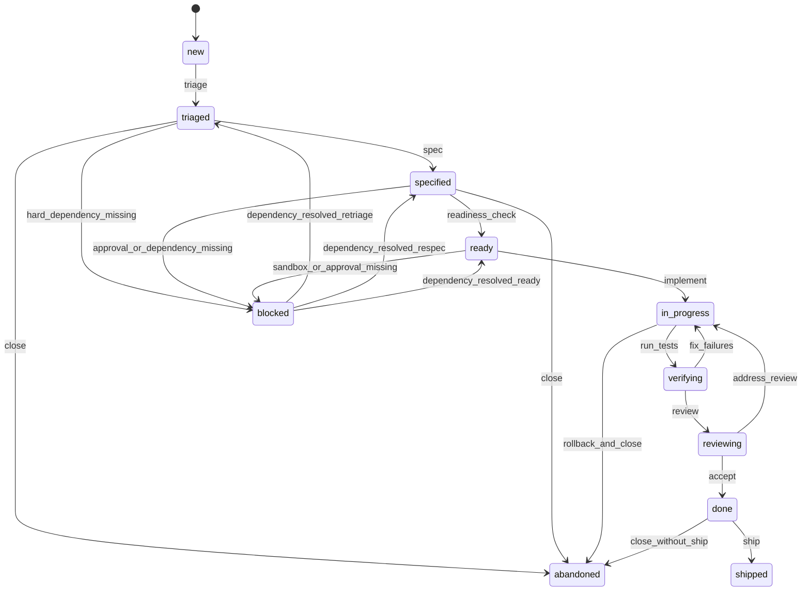

# Ralph Loop (Chiron) — Methodology Definition (2026-02-14)

Ralph Loop is Chiron’s self-referential development loop: an execution model that repeatedly **detects** work, **plans** it, **implements** changes, **verifies** them, **reflects** on outcomes, and **repeats** until the work item is shipped or intentionally closed.

## 1) Core Loop

### Loop phases (canonical)

1. **Detect**: identify a candidate work item and capture evidence.
2. **Plan**: decide intent, scope, constraints, acceptance checks.
3. **Implement**: make the smallest correct change.
4. **Verify**: run deterministic checks; produce a report.
5. **Reflect**: log decisions, deltas, and next iteration triggers.
6. **Repeat**: either iterate (new detect) or ship/close.

### Granular step outputs (per phase)

- **Detect outputs**
  - `investigation_note.md` (problem statement + evidence)
  - `work_item.yaml` (type, scope, links, dependencies)
  - `repro.md` or `repro.steps` (if bug/behavior)
- **Plan outputs**
  - `spec.md` (acceptance criteria + non-goals)
  - `decision_log.md` entry (key choices + rationale)
  - `verification_plan.md` (tests/commands + expected signals)
- **Implement outputs**
  - `diff` (git diff / patch)
  - `file_ref` list (touched paths + intent)
  - `tooling_log` (any approved side effects)
- **Verify outputs**
  - `test_report.md` (commands, results, links)
  - `observability_snapshot.json` (events/trace pointers)
- **Reflect outputs**
  - `reflection.md` (what changed, what broke, what next)
  - updated `work_item.yaml` (status + next transition)
- **Repeat outputs**
  - either `next_iteration.md` (new detect) or `rollout_note.md` (ship)

## 2) Work Item Types

Each work item is **exactly one** of:

- **issue**
  - Intent: fix a bug, regression, or correctness gap.
  - Must have: repro or evidence; expected vs actual.
- **patch**
  - Intent: small targeted improvement or minor feature slice.
  - Must have: explicit acceptance checks; small blast radius.
- **investigation**
  - Intent: reduce uncertainty; produce actionable conclusions.
  - Must have: question(s), evidence gathered, decision/recommendation.
- **refactor**
  - Intent: structural change without intended behavior change.
  - Must have: invariants preserved; verification proves “no behavior change” within agreed scope.

## 3) Statuses and Semantics

Statuses describe **what is true right now**, not what we hope to do.

- `new`: detected, not yet triaged.
- `triaged`: type confirmed; impact/scope bounded; dependencies captured.
- `specified`: plan complete; acceptance + verification plan written.
- `ready`: all prerequisites satisfied; safe to implement now.
- `in_progress`: implementation underway in an isolated sandbox/worktree.
- `verifying`: running checks; failures are being resolved.
- `blocked`: cannot proceed due to hard dependency or missing approval.
- `reviewing`: changes ready for human/agent review; awaiting findings.
- `done`: acceptance criteria met; merge-ready artifact exists.
- `shipped`: released/rolled out (or otherwise delivered) with rollout note.
- `abandoned`: intentionally stopped; reflection includes reason and alternatives.

## 4) State Machine and Transitions

### State machine (authoritative)



### Transition rules (deterministic)

A transition is permitted only if its **required outputs** exist and meet formatting rules.

## 5) Workflows Mapped to Transitions

Workflows are named, repeatable procedures that move a work item through transitions.

| Workflow | From -> To | Purpose |
|---|---|---|
| triage | `new -> triaged` | confirm type, impact, repro/evidence, dependencies |
| spec | `triaged -> specified` | define acceptance + verification plan + constraints |
| readiness_check | `specified -> ready` | ensure dependencies/approvals/sandbox prerequisites are satisfied |
| implement | `ready -> in_progress` | perform changes in isolated worktree with logged side effects |
| run_tests | `in_progress -> verifying` | execute verification plan; generate test report |
| fix_failures | `verifying -> in_progress` | tighten implementation until verification passes |
| review | `verifying -> reviewing` | structured review (code + risk + rollback) |
| address_review | `reviewing -> in_progress` | incorporate review changes |
| accept | `reviewing -> done` | confirm acceptance criteria met with evidence |
| ship | `done -> shipped` | rollout/release + rollout note + observability pointers |

## 6) Deterministic Transition Requirements

### Output types (canonical artifacts)

- `diff`: a patch representation (git diff or unified diff)
- `file_ref`: a list of touched files as clickable paths (workspace-relative)
- `test_report`: commands + pass/fail + key logs
- `decision_log`: decisions with alternatives and rationale
- `rollout_note`: what changed, how released, how to monitor/rollback
- `observability_snapshot`: event/trace pointers for the execution

### Link patterns (must be machine-parseable)

Use these forms inside artifacts:

- Work item: `workitem:<slug>` (e.g. `workitem:ralph-loop-refactor-001`)
- Dependency edge: `depends_on(workitem:<slug>, strength:<hard|soft>)`
- File reference: `` `apps/web/src/.../file.ts` `` optionally with `:line[:col]`
- Commit: `commit:<sha>`
- PR: `pr:<number>` (if applicable)
- Execution trace: `trace:<executionId>`
- Sandbox/worktree: `worktree:<id>`

### Dependency strengths (semantics)

- `hard`: cannot transition past `blocked` until satisfied.
- `soft`: can proceed with explicit risk note in `decision_log`.

### Transition gates (required artifacts)

- **triage (`new -> triaged`) requires**
  - `investigation_note.md` with at least: problem statement + evidence links
  - `work_item.yaml` with: `type`, `owner`, `links`, `dependencies[]`
- **spec (`triaged -> specified`) requires**
  - `spec.md` with: acceptance criteria + non-goals
  - `verification_plan.md` with: commands + expected signals
  - `decision_log.md` entry: chosen approach + why now
- **readiness_check (`specified -> ready`) requires**
  - all `hard` dependencies resolved OR move to `blocked`
  - approvals pre-registered for any side effects (tooling-engine)
  - sandbox/worktree allocated (sandbox-engine)
- **implement (`ready -> in_progress`) requires**
  - `worktree:<id>` created; base revision recorded
  - `diff` and `file_ref` generated for every implementation iteration
- **run_tests (`in_progress -> verifying`) requires**
  - `test_report.md` created by running `verification_plan.md` commands
  - `observability_snapshot.json` with `trace:<executionId>` pointer(s)
- **review (`verifying -> reviewing`) requires**
  - `diff` + `file_ref` + `test_report.md`
  - `rollout_note.md` draft if shipping is intended
- **accept (`reviewing -> done`) requires**
  - explicit mapping: each acceptance criterion -> evidence (file/test/log link)
  - no unresolved `hard` dependencies
- **ship (`done -> shipped`) requires**
  - finalized `rollout_note.md` (monitoring + rollback)
  - `decision_log.md` “ship decision” entry (risk + mitigations)

## 7) Outputs per Workflow (granular)

### triage

- `investigation_note.md`
- `work_item.yaml`
- optional `repro.md`

### spec

- `spec.md`
- `verification_plan.md`
- `decision_log.md` entry (timestamped)

### implement

- `diff` (per iteration)
- `file_ref` list (per iteration)
- `tooling_log.md` (only if tooling-engine side effects executed)

### run_tests

- `test_report.md`
- `observability_snapshot.json`

### review

- `review_notes.md` (findings + required changes)
- updated `decision_log.md` entry (if approach changes)

### ship

- `rollout_note.md`
- updated `work_item.yaml` status `shipped`
- `observability_snapshot.json` updated with post-ship pointers (if available)

## 8) Locked Modules and How They Contribute

Locked modules act as “methodology enforcers”: they constrain Ralph Loop execution to remain deterministic, auditable, and interruptible.

### workflow-engine orchestration (Effect Fibers)

- Enforces the loop as an explicit state machine: transitions happen only via registered handlers.
- Provides concurrency boundaries: each work item execution is a supervised Fiber; cancellation propagates through Scope.

### tooling approvals (tooling-engine)

- All side effects (filesystem writes, git operations, network calls) are routed through an approval flow.
- Produces an auditable `tooling_log` and ensures “no hidden work” between transitions.

### sandbox git worktrees (sandbox-engine)

- Every `implement` run happens in an isolated worktree (`worktree:<id>`), guaranteeing clean diffs and repeatable verification.
- Enables safe parallel Ralph Loops without cross-contamination.

### observability (event-bus + execution traces)

- Emits lifecycle events for every transition and tool invocation; attaches `trace:<executionId>` to artifacts.
- Makes failures diagnosable: `test_report` references trace pointers, and reflections cite event sequences.

## 9) Minimal Artifact Templates (recommended)

### `work_item.yaml`

```yaml
id: workitem:<slug>
type: issue|patch|investigation|refactor
status: new|triaged|specified|ready|in_progress|verifying|blocked|reviewing|done|shipped|abandoned
title: "<human title>"
owner: "<agent_or_user>"
links:
  - "trace:<executionId>"
dependencies:
  - id: "workitem:<other>"
    strength: hard|soft
acceptance:
  - "<criterion 1>"
verification:
  - "<command or check 1>"
```

### `decision_log.md` entry

```md
- date: 2026-02-14
  workitem: workitem:<slug>
  decision: <what we chose>
  alternatives: <what we did not choose>
  rationale: <why>
  risks: <known risks>
  mitigations: <mitigations>
  links: trace:<executionId>
```

### `test_report.md`

```md
# Test Report — workitem:<slug>

- worktree: worktree:<id>
- base: commit:<sha>
- trace: trace:<executionId>

## Commands
- `<command 1>`
- `<command 2>`

## Results
- status: PASS|FAIL
- notes: <key failures or confirmations>
```

### `rollout_note.md`

```md
# Rollout Note — workitem:<slug>

- change: <what changed>
- release: <how shipped>
- monitor: <signals to watch>
- rollback: <how to revert>
- links: trace:<executionId>, commit:<sha>
```
