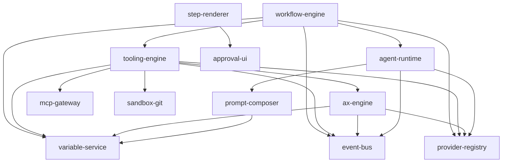

# Chiron Module Structure (Proposed)

This document captures the proposed module structure and dependency graph for Chiron.

## Dependency Graph

## Modules

### Core Runtime
- workflow-engine: workflow + step execution, state transitions, approvals orchestration.
- ax-engine: AX registry, resolver, execution, optimizer, examples store.
- agent-runtime: agent step execution with agentKind adapters (chiron, opencode, later codex/claude-code).

### Shared Infrastructure
- variable-service: canonical variable resolution, precedence, history, templates.
- prompt-composer: structured prompt spec and adapter rendering per agentKind.
- tooling-engine: tool registry, approvals, execution; bridges ax-generation to ax-engine.
- provider-registry: model catalog + credentials (per-user, global across projects), usage tracking, spend estimates, and provider limits.
- event-bus: unified streaming and lifecycle events.
- mcp-gateway: MCP tool discovery and schema exposure (optional; replaced by OpenCode custom tools by default).
- sandbox-git: worktree ops, apply changes, cleanup.

### UI Layer
- step-renderer: step_type -> UI component registry.
- approval-ui: approval cards, pending queue, tool status.

## Agent Step Type

Single step type: `agent`
- agentKind: `chiron`, `opencode` (future: `codex`, `claude-code`)
- agentKind adapter renders prompt and tool schema specifics

## Notes
- This structure is intended to replace the current monolithic services under packages/api/src/services.
- The workflow-engine remains the orchestrator; ax-engine and agent-runtime are invoked via tooling-engine.
