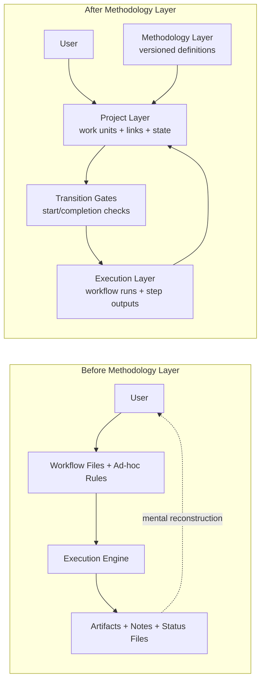
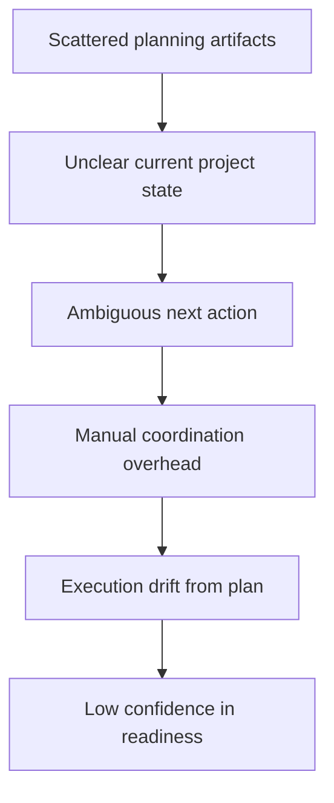
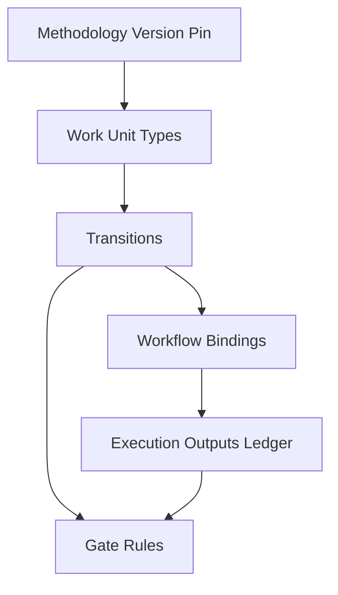
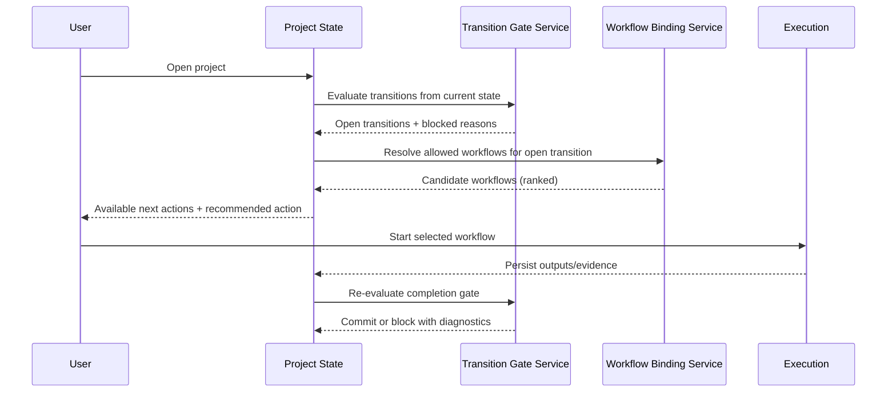
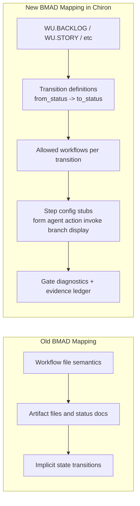
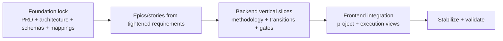
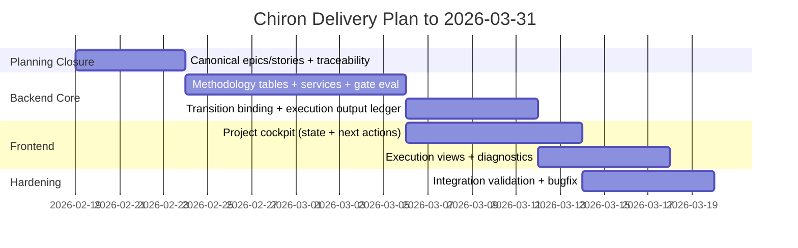

# Chiron Methodology Layer Diagram Pack v1 (Week 6)

Date: 2026-02-19
Purpose: explain pre-methodology architecture issues, why methodology layer was introduced, and why this increases probability of delivery by 2026-03-31.

## 1) Storyline (for presentation)

1. Before: Chiron operated with workflows and execution, but project mental model lived in user heads and scattered docs.
2. Problem: weak state visibility, ambiguous next action, drift between planning and execution, hard traceability.
3. Intervention: introduce Methodology Layer (versioned work-unit model + transitions + gates + workflow bindings).
4. After: deterministic "what can I do now?", explicit dependencies, auditable evidence, lower cognitive load.
5. Result: implementation focus shifts from inventing process every run to executing known contracts.

---

## 2) Diagram A - Before vs After Architecture



Talk track:
- Before: execution existed, but project state machine was implicit.
- After: methodology defines allowed moves; project and execution stay synchronized.

---

## 3) Diagram B - Core Pain Points Before



Evidence themes to narrate:
- Coupling/drift concerns in architecture/design docs.
- Legacy migration docs showing state/traceability fragility and heavy cognitive overhead.

---

## 4) Diagram C - What Methodology Layer Adds



Key message:
- Next action is no longer guessed; it is computed from open transitions and gate satisfaction.

---

## 5) Diagram D - "Where Am I / What Next" Decision Loop



This directly supports your point:
- Multiple next actions can be valid.
- Recommendation is transition/gate-driven, not arbitrary.

---

## 6) Diagram E - BMAD Mapping Before vs Now



Concrete examples:
- `create-epics-and-stories` now maps to `WU.BACKLOG` transition `draft -> done`.
- `dev-story` maps to `WU.STORY` transition `ready -> review` with explicit outputs.

---

## 7) Diagram F - Why "No Big Build Yet" Is Rational



Narrative:
- The team is reducing downstream rework by locking contracts first.
- "Not doing everything yet" is deliberate risk compression.

---

## 8) March 31 Feasibility Argument (Slide-ready)



Argument points:
- Scope is constrained by locked step system and fixed methodology contracts.
- Progress can be measured by deterministic gates and traceability completion.
- The methodology layer removes ambiguity overhead, increasing delivery predictability.

---

## 9) Optional v0 Explainer Microsite Prompt

Use this prompt in v0 to generate a narrative mock site:

```text
Create a single-page technical explainer website for "Chiron: Why We Introduced the Methodology Layer".

Audience: technical PMs and engineers.
Tone: precise, confident, evidence-based.

Sections:
1) Hero: "Before vs After" with one-sentence thesis.
2) Problem section: 5 pain cards (unclear state, next-action ambiguity, drift, coordination overhead, weak traceability).
3) Architecture comparison: side-by-side diagram panels (Before/After).
4) How it works now: step-by-step loop showing transitions, gate evaluation, workflow selection, execution outputs.
5) BMAD mapping examples: table with old mapping vs new mapping for at least 4 workflows (create-prd, create-epics-and-stories, dev-story, check-implementation-readiness).
6) Why this helps users: "Where am I now?" and "What should I do next?" with UI mock cards.
7) Delivery confidence timeline: now -> March 31 with milestones.
8) Closing: "Why no large feature build yet" as intentional foundation-first strategy.

Visual style:
- Dense, premium technical dashboard (Bloomberg-inspired but modern).
- Fonts: Commit Mono for primary text, Geist Pixel for accents.
- Colors: muted terminal neutrals + restrained status colors.
- Include subtle grid background and clear section anchors.
- Responsive for desktop and mobile.

Output as React + Tailwind components with reusable sections.
```
