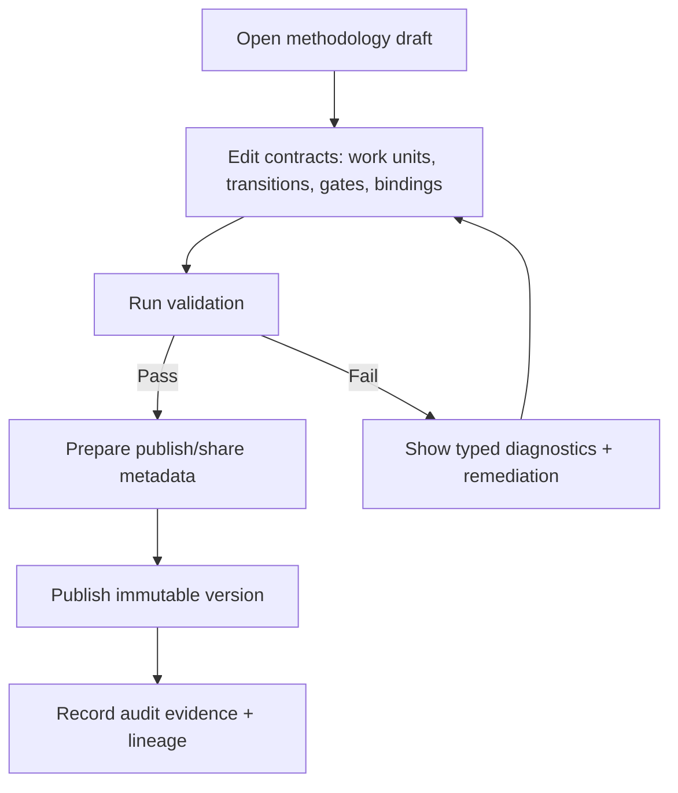
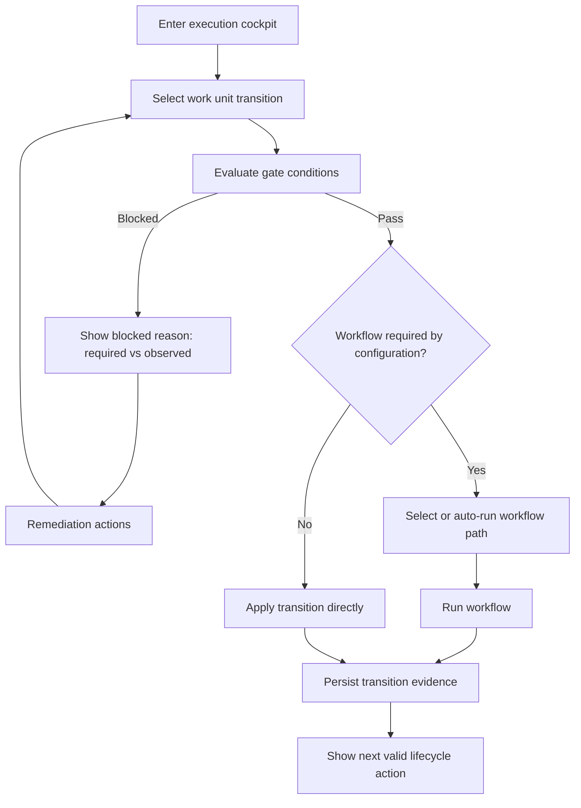
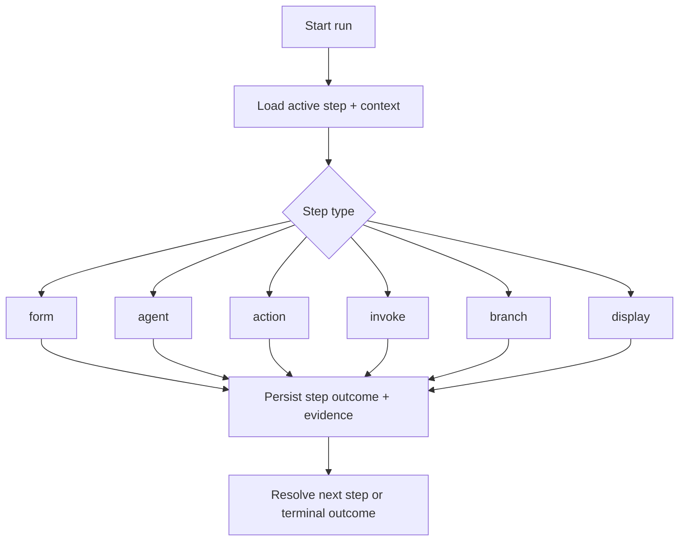

# UX Design Specification chiron

> Canonical Source (2026-02-23): this is the active UX implementation contract.

**Author:** Gondilf
**Date:** 2026-02-22

---

## Executive Summary

### Project Vision

Chiron is a Bloomberg-influenced mission-control workspace for AI-assisted software delivery, built to make BMAD execution deterministic, inspectable, and operable under production pressure. The UX must ensure every transition decision, gate result, and artifact lineage is understandable in real time and reproducible after the fact. The visual language is intentionally locked: Commit Mono + Geist Pixel, with controlled maximalism/minimalism contrast using curated assets to communicate hierarchy, urgency, and focus.

### Target Users

Primary users are intermediate-to-expert software engineers running multi-step planning and implementation workflows with AI agents. Secondary users are technical PMs/workflow operators accountable for readiness gates, dependency integrity, and auditability. These users are keyboard-oriented and expect fast, commandable interaction models in addition to rich visual telemetry.

### Key Design Challenges

1. Semantic precision under complexity: users must reliably distinguish normal/loading/blocked/failed/success states across transitions, invokes, and artifact generation.
2. Dense interface, low cognitive error: the mission-control visual language must remain scannable and accessible while preserving diagnostic depth.
3. Failure-first operability: failures must render stable, actionable diagnostics with clear remediation pathways and no hidden partial commits.
4. Traceability as implementation contract: UX decisions must map directly to FR1..FR7 and architecture interfaces so delivery teams can implement without interpretation drift.
5. Command-first navigation: command palette navigation must coexist with visual workflows without fragmenting mental models.

### Design Opportunities

1. Evidence-native UX: make diagnostics, gate outcomes, and lineage first-class interaction objects to accelerate triage and increase trust.
2. Context-calibrated control surfaces: preserve one visual system while tailoring interaction density for execution and refinement contexts.
3. Command palette as orchestration backbone: introduce global keyboard navigation and action dispatch via command palette patterns (with TanStack Hotkeys support) for fast expert operation.
4. Contract-driven interaction design: define architecture-to-UX contracts (radar semantics, workbench interactions, graph/state projections, diagnostics payload rendering) as explicit build targets.
5. Readiness acceleration: use FR-to-UX traceability matrices and canonical artifact linkage to convert design intent into executable implementation guidance.

## Core User Experience

### Defining Experience

Chiron is a guidance-and-orchestration system for the software development lifecycle. Its business value is turning complex delivery work into a deterministic, evidence-backed progression from idea to implementation readiness.

It serves two core interaction contexts:

1. **Execution Orchestration Context (default cadence)**
   Execute projects through guided transitions with explicit gate outcomes, real-time state visibility, and evidence-linked results.

2. **Methodology Refinement Context (episodic cadence)**
   Define and evolve methodology contracts (work units, transitions, gates, workflow bindings) and prepare changes for publishing/sharing.

The shared UX objective across both contexts is the same: make lifecycle progress unambiguous, recoverable, and reproducible. These are interaction contexts, not user types. Every critical interaction must expose explicit state semantics: `normal`, `loading`, `blocked`, `failed`, `success`.

### Platform Strategy

Chiron is desktop-first, visual-first, and power-user accelerated.

- Primary platforms: Linux first, macOS second.
- Primary interaction path: visible controls (buttons, panels, graph interactions, dialogs).
- Accelerator path: command palette + hotkeys as first-class support for power users.
- Both paths must expose equivalent valid actions and equivalent outcomes.

Real-time behavior is in current scope:

- Live event-driven projections for execution, transition, artifact, and diagnostic updates.
- Parent/child lineage visibility for invoke behavior.
- Concurrency visibility (parallel active runs, contention/blocking indicators, reconnect continuity).
- Deterministic terminal-state rendering (no duplicate/conflicting terminal outcomes).

Automation boundary for this phase:

- In scope: user-supervised automation assists (recommended next action, safe one-step actions).
- Deferred: fully autonomous control-loop dashboard behaviors and deeper automation surfaces not required for immediate implementation readiness.

### Effortless Interactions

The following actions must be one-step, low-friction, and consistent:

1. Open command palette and navigate directly to any work unit, workflow, artifact, or diagnostic.
2. Execute recommended next action immediately, with preserved access to all gate-open actions.
3. Switch graph projection mode (`state-machine`, `dependency`, `actionability`) without losing context.
4. Open latest blocking diagnostic and copy/share evidence references in one action.
5. Trigger `retry`, `resume`, `cancel` through consistent verbs and deterministic confirmations.

### Critical Success Moments

1. Eligibility clarity: user immediately understands why a transition is executable or blocked.
2. Live execution control: user can monitor progress and intervene safely without state ambiguity.
3. Failure recovery: failure output is stable, actionable, and leads to reproducible success.
4. Concurrency trust: simultaneous activity remains understandable, attributable, and non-contradictory.

### Experience Principles

1. Deterministic state over implied state.
2. Evidence-linked decisions over inferred decisions.
3. Visual-first navigation with first-class power-user acceleration.
4. Failure is explicit, actionable, and recoverable.
5. Status semantics are text-addressable (never color-only).
6. Equivalent failures render equivalent message structure and intent.
7. Locked visual direction: Commit Mono + Geist Pixel + controlled maximalism/minimalism contrast.
8. Layered asset semantics:
   - Structural layer: geometric assets for framing and hierarchy.
   - Identity layer: avatars for `agent`, `workflow`, and `work unit`.
   - Signal layer: high-energy accents for transient urgency states only.

Error communication standard (applies across all critical flows):

- UI must always state: what happened, why it happened (when known), what to do next, and what is preserved/safe.
- Rendering must use stable diagnostic fields: `code`, `scope`, `blocking`, `required`, `observed`, `remediation`, `timestamp`, evidence refs.
- Internal debug details are available for logs, but not primary user-facing copy.

## Desired Emotional Response

### Primary Emotional Goals

1. **Guided confidence:** users feel led, not lost, while moving from idea to implementation readiness.
2. **Deterministic trust:** users trust the system because outcomes and diagnostics are stable under equivalent conditions.
3. **Calm recovery:** failures feel manageable, actionable, and non-destructive.
4. **Progress momentum:** users feel measurable forward motion across lifecycle stages.

### Emotional Journey Mapping

- **First discovery**
  - Target emotion: orientation.
  - UX requirement: immediate clarity on product purpose, current state, and next possible action.

- **Core operation (execution and refinement contexts)**
  - Target emotion: confidence.
  - UX requirement: explicit gate logic, visible dependencies, and understandable action consequences.

- **Execution monitoring**
  - Target emotion: control.
  - UX requirement: real-time state projection with attributable events and non-contradictory terminal outcomes.

- **Failure/blocked conditions**
  - Target emotion: calm agency.
  - UX requirement: structured message with what happened, why, next action, and what remains safe.

- **Completion and return**
  - Target emotion: accomplishment and continuity.
  - UX requirement: persisted evidence, clear completion semantics, and fast re-entry into next lifecycle step.

### Micro-Emotions

- **Methodology refinement context**
  - Assurance when contracts are valid and publishable.
  - Responsibility when constraints are explicit and auditable.

- **Execution orchestration context**
  - Certainty when transitions are explainable.
  - Relief when blocked/failed paths provide deterministic remediation.
  - Agency when visual controls and command acceleration reach the same valid outcomes.

### Design Implications

1. Emotional trust must be encoded in deterministic state + evidence, not visual polish alone.
2. Failure copy must follow a stable rendering contract and avoid vague/blaming language.
3. Real-time updates must preserve coherence under concurrency and reconnect scenarios.
4. Visual language (Commit Mono, Geist Pixel, layered assets, avatar cues) should reinforce hierarchy and identity, never replace semantics.
5. Both navigation paths (visible controls and command palette/hotkeys) must preserve identical action validity.

### Emotional Design Principles

1. Clarity before cleverness.
2. Determinism before decoration.
3. Recovery before escalation.
4. Guidance before guessing.
5. Confidence through explicit evidence.

## UX Pattern Analysis & Inspiration

### Inspiring Products Analysis

1. **Linear (planning surface quality)**
   - Strong list/board parity with fast filtering and predictable state transitions.
   - Relevant to Chiron for refinement and execution planning surfaces where clarity must hold under dense data.

2. **OpenCode / OpenCode Desktop / T3 Chat (agent-step interaction quality)**
   - Strong message hierarchy, context attachment ergonomics, and transparent tool-call display.
   - Relevant to Chiron's `agent` steps, especially for separating user intent, model reasoning, tool execution, and outcome diagnostics.

3. **Temporal / Prefect / Dagster / Airflow (orchestration observability quality)**
   - Strong execution history, run-state visibility, graph/timeline monitoring, and failure localization.
   - Relevant to Chiron for deterministic transition tracking, graph-following, and evidence-linked debugging.

4. **LangSmith-style traceability patterns**
   - Strong nested run/tool trace visibility and chronology.
   - Relevant to Chiron for node -> attempt -> diagnostics -> artifact drill-down and reproducible troubleshooting.

### Transferable UX Patterns

1. **Graph-following execution path**
   - Show active node, completed path, pending branches, and parent/child invoke lineage in one coherent projection.

2. **Graph + timeline coherence**
   - Graph view and timeline view must reflect the same execution truth, not parallel interpretations.

3. **Deterministic state contract**
   - Every critical entity (node/edge/attempt) renders explicit state semantics: `normal`, `loading`, `blocked`, `failed`, `success`.

4. **Context-linked diagnostics**
   - Diagnostics bind directly to the exact transition/node/attempt with stable evidence references and remediation.

5. **Transparent tool calling**
   - Tool activity is visible as first-class runtime events, including call intent, status, result, and blocking reasons.

6. **Dual navigation parity**
   - Visible controls and command palette/hotkeys expose equivalent valid actions and equivalent outcomes.

7. **Reproducible filtering/projections**
   - Filters and projection modes (`state-machine`, `dependency`, `actionability`) are saved/shareable and deterministic.

### Anti-Patterns to Avoid

1. Graphs that are visually impressive but do not show current execution truth.
2. Hidden automation decisions without visible causality or evidence links.
3. Generic failure text when deterministic cause/remediation exists.
4. Keyboard-only assumptions that reduce discoverability for non-power users.
5. Asset-heavy decoration that obscures hierarchy, identity, or status semantics.
6. Terminology drift between refinement and execution contexts.

### Design Inspiration Strategy (Critical Refinement)

Chiron does not copy any single product UI. It combines three pattern archetypes with explicit boundaries:

1. Planning Clarity Archetype (Linear-like)
   - Adopt: reproducible filters, list/board parity, fast stateful navigation.
   - Do not adopt: generic task language that hides methodology semantics.

2. Agent Transparency Archetype (OpenCode/T3-like)
   - Adopt: explicit message strata (intent, model output, tool action, result), visible tool-call lifecycle, context-linking.
   - Do not adopt: opaque "assistant did something" outputs without causal trace.

3. Orchestration Observability Archetype (Temporal/Prefect/Dagster/Airflow/LangSmith-like)
   - Adopt: graph + timeline coherence, run lineage, deterministic failure localization.
   - Do not adopt: execution visuals without evidence-linked diagnostics.

Implementation rule:

- Every adopted pattern must map to a Chiron primitive (`work unit`, `transition`, `gate`, `invoke`, `evidence`) and a deterministic state contract (`normal/loading/blocked/failed/success`).

Audience rule:

- Refinement-focused projections prioritize contract validity/publishability.
- Execution-focused projections prioritize run-state legibility/recovery.
- Both projections must resolve to the same evidence model.

### Cross-Functional Readiness Checks (War Room Outcome)

To move from inspiration to implementation-ready UX, adopted patterns must pass all checks below:

1. **Semantic Mapping Check (PM + UX)**
   - Pattern maps to Chiron primitives (`work unit`, `transition`, `gate`, `invoke`, `evidence`).
   - Pattern does not introduce generic PM vocabulary drift.

2. **Projection Coherence Check (UX + FE)**
   - Graph and timeline projections are generated from the same execution truth.
   - At minimum, graph-following shows: active path, blocked node cause, child invoke lineage, terminal reason.

3. **Diagnostics Linkage Check (FE + BE)**
   - Failure/blocked states link to stable references: `executionId`, `transitionAttemptId`, attempt-level context.
   - Rendered diagnostics preserve deterministic structure and remediation.

4. **State Contract Check (UX + QA)**
   - Critical entities expose explicit states: `normal`, `loading`, `blocked`, `failed`, `success`.
   - Equivalent conditions produce equivalent visible outcomes.

5. **Parity Check (UX + FE + QA)**
   - Visual controls and command palette/hotkeys can reach the same valid actions and outcomes.

## Design System Foundation

### 1.1 Design System Choice

Chiron adopts a themeable, shadcn-compatible design-system approach with governed multi-source primitives and registry-driven component composition.

### Rationale for Selection

1. Preserves delivery speed by reusing proven component patterns and accessibility primitives.
2. Preserves uniqueness through Chiron-specific tokens, semantics, and mission-control interaction contracts.
3. Supports implementation-readiness by balancing flexibility with explicit component governance.

### Implementation Approach

1. Use shadcn-compatible composition as the primary UI foundation.
2. Source components from the official shadcn directory/registry (`https://ui.shadcn.com/docs/directory`) via shadcn MCP as the default acquisition path.
3. Primitive policy:
   - Default primitive baseline: Radix UI.
   - Secondary approved primitive source: Base UI, only when it provides a clearly better fit for a component family.
4. Custom/internal component sources are allowed but exceptional:
   - Use only when official shadcn sources do not satisfy Chiron contracts.
   - Require documented justification and governance approval.
5. Apply Chiron interaction/state contracts above primitive components:
   - deterministic states (`normal`, `loading`, `blocked`, `failed`, `success`)
   - diagnostics rendering contract
   - graph/timeline coherence
   - visual-control and command-path parity

### Customization Strategy

1. Lock typography and visual language (Commit Mono, Geist Pixel, controlled min-max contrast).
2. Build mission-control variants for dense operational surfaces.
3. Enforce component governance:
   - one primitive foundation per component family
   - no mixed primitive internals in the same family
   - no parallel duplicate components without documented reason
   - adoption gate: accessibility parity, API fit, performance, and maintenance cost
4. Track component provenance (source, adaptations, and Chiron contract bindings).
5. Themeability forward-compatibility:
   - define semantic CSS variables now
   - require token consumption in components
   - defer runtime theme override mechanism to a later implementation phase

### Governance and Failure Prevention

1. Component-family primitive rule:
   - A component family (for example, Tabs, Dialog, Popover) uses one primitive foundation.
   - Mixing primitive internals within the same family is disallowed.
2. Registry adaptation rule:
   - Registry components are starting points, not final implementations.
   - Every adopted component must bind to Chiron state, diagnostics, and parity contracts.
3. Parity rule:
   - Actions reachable via visible controls must be reachable via command palette/hotkeys with equivalent validation and outcomes.
   - Actions reachable via command palette/hotkeys must remain discoverable through visible controls.
4. Streaming coherence rule:
   - Stream and reconnect handling must not produce contradictory terminal states.
5. Token compliance rule:
   - Typography, color, spacing, density, and motion must come from Chiron tokens.
6. Adoption gate:
   - Accept a component source only if it passes accessibility, API fit, performance, and maintainability/provenance checks.

### Rollout Sequence (Implementation Control)

1. Define semantic contracts first (state semantics, diagnostics structure, parity behavior).
2. Build and approve primitive-backed base components by family.
3. Apply Chiron tokens and mission-control variants.
4. Integrate streaming and command-path behavior.
5. Validate against acceptance gates before family-wide adoption.

### Component Intake Checklist (Registry/Primitive Governance)

A component enters Chiron only if it has:

1. Source provenance explicitly marked as:
   - official shadcn directory/registry (default), or
   - custom/internal exception path with documented justification
2. Assigned family owner and primitive foundation (Radix UI or Base UI).
3. Bound Chiron contracts:
   - state semantics (`normal`, `loading`, `blocked`, `failed`, `success`)
   - diagnostics rendering contract
   - visual-control and command-path parity contract
4. Accessibility verification (keyboard, focus, semantics, and contrast).
5. Streaming behavior verification for live-updating components.
6. Determinism test coverage (equivalent inputs produce equivalent visible outcomes).

### Ownership Boundary

- Backend Effect services own diagnostic schema definitions and event semantics.
- Frontend owns deterministic rendering and interaction behavior for those schemas.
- UX documentation defines user-facing contract expectations; architecture documentation governs transport/runtime internals.

### Definition of Done for Component Families

A family is approved only when:

1. It passes all relevant state semantics in critical flows.
2. Visible-control and command-path interactions produce equivalent validated outcomes.
3. Accessibility checks pass in dense operational contexts.
4. Token compliance is verified with no ungoverned style bypass.
5. Failure and blocked messaging follow the Chiron error communication standard.

### Architecture Decision Records (UX System Governance)

#### ADR-UX-DS-001: Design-System Foundation

- Status: Accepted
- Decision: Use a themeable, shadcn-compatible composition layer as the system foundation.

#### ADR-UX-DS-002: Component Source Policy

- Status: Accepted
- Decision: Default source path is the official shadcn directory/registry (`https://ui.shadcn.com/docs/directory`) via shadcn MCP. Non-shadcn/custom internal sources are exception-only.

#### ADR-UX-DS-003: Primitive Policy

- Status: Accepted
- Decision: Radix UI is default. Base UI is secondary when demonstrably better for a family. One primitive foundation per family.

#### ADR-UX-DS-004: Semantic Contract Supremacy

- Status: Accepted
- Decision: Chiron semantic contracts are mandatory regardless of component source:
  - state contract (`normal`, `loading`, `blocked`, `failed`, `success`)
  - diagnostics rendering contract
  - visual-control and command-path parity contract

#### ADR-UX-DS-005: Exception Governance

- Status: Accepted
- Decision: Exception components require written justification and must pass adoption gates before release.

## 2. Core User Experience

### 2.1 Defining Experience

Chiron's defining experience is: **surface the next valid lifecycle action, execute it safely, and prove the result with deterministic evidence**.

Chiron provides two interaction contexts over the same account and capability model:

1. **Execution Orchestration Context (default, day-to-day)**
   - Run transitions with explicit eligibility, live progress visibility, and evidence-linked outcomes.

2. **Methodology Refinement Context (episodic, intentional)**
   - Refine lifecycle configuration (work units, transitions, gates, bindings) and prepare/publish/share methodology changes.

These contexts are UX emphasis models, not user types and not authorization boundaries.

### 2.2 User Mental Model

Users do not think "I changed roles." They think:

- "Help me move this project forward now." (execution)
- "Let me tune how this lifecycle should work." (refinement)

Expected behavior:

1. Execution is the default landing posture.
2. Refinement is intentionally entered when process evolution is needed.
3. Vocabulary, command capabilities, and evidence semantics remain consistent across contexts.
4. Sharing methodology is a refinement outcome, not a separate identity path.

### 2.3 Success Criteria

1. Users identify the next valid action within seconds.
2. `blocked` vs `failed` is unambiguous at point of decision.
3. Equivalent conditions yield equivalent visible outcomes and message intent.
4. Outcomes are trusted because evidence references are explicit and traceable.
5. Visual controls and command acceleration produce equivalent validated outcomes.
6. Transition between execution and refinement does not require relearning interaction semantics.
7. Methodology changes can be prepared and shared without breaking execution clarity.

### 2.4 Novel UX Patterns

Chiron's novelty is deterministic lifecycle guidance with cadence-aware contexts:

- frequent execution guidance,
- episodic methodology refinement and sharing,
- both grounded in one evidence model and one command model.

### 2.5 Experience Mechanics

1. **Initiation**
   - User lands in execution context by default.
   - System surfaces current lifecycle state, valid next actions, and blocker context.

2. **Interaction**
   - User executes transitions via visible controls or command acceleration.
   - User enters refinement intentionally to adjust lifecycle configuration and sharing-ready methodology artifacts.

3. **Feedback**
   - State, diagnostics, and evidence remain deterministic across contexts.
   - Graph/timeline/artifact views remain coherent projections of the same execution truth.

4. **Completion**
   - Terminal outcome is explicit and evidence-linked.
   - System presents the next valid lifecycle action; if in refinement context, it also presents configuration/share follow-ups.

## Visual Design Foundation

### Color System

Chiron uses a semantics-first color model with dark-first operational defaults and light-theme parity.

#### Semantic Families

- Neutral foundation: `CARBON`, `FROST`, `CAMO`
- Informational support: `WINTER`, `TERRAIN`
- High-attention accents: `FLUO`, `ALERT`, `DAWN`

#### State Mapping (Stable Across Surfaces)

- `success`: TERRAIN family
- `info/progress`: WINTER family
- `warning`: DAWN family
- `error/destructive`: ALERT family
- `focus/active`: FLUO family (short-lived emphasis only)

Equivalent states must use equivalent semantic families across all surfaces.

#### Dark/Light Parity Rule

- Dark mode is operational default.
- Light mode is first-class and semantically equivalent.
- Token meaning does not change between themes; luminance/chroma adapts for readability.

#### Accent Budget Rules

- High-chroma colors (`FLUO`, ALERT red, DAWN orange) cannot dominate large background regions.
- Neutral surfaces remain visually dominant in dense workflows.
- Accent usage is reserved for actionable state change, focus indication, and bounded urgency communication.

#### Tokenization Policy

Color decisions are consumed through semantic tokens, not hardcoded palette values:

- surface/background tokens
- text hierarchy tokens
- state tokens (`success/info/warning/error/focus`)
- interaction tokens (`hover/active/selected/ring`)

### Typography System

Chiron uses a dominant operational typeface with a constrained accent typeface.

1. Primary typeface (dominant): `Commit Mono`
   - Use for body text, tables, logs, forms, diagnostics, timeline labels, command palette content, and high-frequency reading surfaces.
2. Accent typeface (sparse): `Geist Pixel`
   - Use for section markers, compact display labels, high-attention signifiers, and selected identity badges.
   - Do not use for paragraphs, dense data cells, long labels, or diagnostic prose.
3. Dominance ratio:
   - `Commit Mono`: ~90-95% of rendered text.
   - `Geist Pixel`: ~5-10% of rendered text.
4. Readability guardrails:
   - Pixel font is not used at tiny sizes where shape ambiguity appears.
   - Critical action labels and error/remediation text remain in `Commit Mono`.
   - Line-height and spacing rhythm stay consistent on dense screens.

### Spacing & Layout Foundation

Chiron uses layered density by context depth, not by personal preference.

#### Base System

- 8px spacing grid with 4px micro-steps.
- Sharp geometry (`radius: 0`) across core surfaces.
- Explicit exposed borders and separators in all density modes.
- Density changes spacing rhythm, not component semantics.

#### Density Modes

1. Compact (operational shell)
   - Use for cockpit, graph shell, timeline, diagnostics lists, command palette, and high-frequency controls.
2. Standard (active working context)
   - Use for inspectors, forms, artifact side panes, decision cards, and remediation blocks.
3. Comfortable (deep context layers)
   - Use for reading dialogs, rich-editor focus states, and long-form review or approval modals.

#### Cross-Mode Constraints

1. Same visual grammar in all modes: sharp edges, visible borders, strict alignment.
2. Switching density never changes action availability or state meaning.
3. Visual-control and command-path parity holds across all layers.
4. Comfortable mode is allowed only in deep-context layers, not default shell density.

### Accessibility Considerations

1. Contrast thresholds (required)
   - Body text: minimum 4.5:1.
   - Large text (>= 18px regular or >= 14px bold): minimum 3:1.
   - UI non-text elements (borders, icons, focus rings, control boundaries): minimum 3:1 against adjacent surfaces.
2. State communication rules
   - State is never color-only.
   - Every `normal/loading/blocked/failed/success` indication includes explicit label and iconography.
   - `blocked` and `failed` remain visually and semantically distinct in both themes.
3. Theme parity
   - Dark and light themes preserve identical semantic meaning for tokens.
   - If contrast fails in one theme, token values adjust without changing semantic mapping.
4. Long-session readability controls
   - High-chroma accents are bounded to signal regions, not large reading surfaces.
   - Diagnostic/remediation text uses high-legibility text tokens (never accent-on-accent).
5. Focus and keyboard visibility
   - Focus indicators remain visible on all interactive controls in both themes and all density modes.
   - Command-path and visual-path interactions expose equivalent focus and active-state clarity.
6. State icon semantics (memorable and pronounced)
   - Stable icon-to-state mapping across all surfaces:
     - `normal`: neutral idle marker
     - `loading`: progress/spinner marker
     - `blocked`: barrier/ineligible marker
     - `failed`: terminal error marker
     - `success`: completion marker
   - Icons appear before labels and keep consistent size and placement for scan memory.
   - Triple encoding is required: `icon + explicit label + color token`.
   - Icons remain distinguishable in grayscale and low-saturation conditions.
7. Motion and streaming transitions
   - Streaming updates avoid rapid flashing or color-churn.
   - State transitions use calm, short, deterministic animations that do not obscure status meaning.

### Step-8 Implementation Readiness Checks (War Room)

1. Scope guard
   - In scope now: semantic tokens, dark/light parity, state visuals, density rules, and accessibility contracts.
   - Out of scope now: full runtime theme engine and broad visual experimentation outside token policy.
2. Density enforcement
   - `Compact`: execution shell.
   - `Standard`: active working panes.
   - `Comfortable`: deep-read and deep-edit dialogs only.
3. Token implementation contract
   - Required token groups: surface/text hierarchy, state, interaction, border/separator.
   - No hardcoded palette values in production components.
4. Streaming-state coherence
   - Visual transitions follow event-order semantics.
   - Reconnect/replay cannot produce contradictory terminal visuals.
5. Visual QA gate
   - Dark/light themes preserve semantic parity.
   - Contrast thresholds pass for text and non-text controls.
   - Triple state encoding exists in critical flows.

## Design Direction Decision

### Design Directions Explored

Primary candidate directions evaluated for the same concrete page scope (`Execution Orchestration Cockpit`):

- `D2` Command + Graph Split
- `D5` Graph-first Mission Control
- `D8` Balanced Adaptive

All directions were compared using one page scope with explicit context labels (`page`, `intent`, `primary action`, `scenario`) to avoid abstract interpretation drift.

### Chosen Direction

**D8 Ops Variant (Execution-Balanced System)**

Base from `D8`, with structural modifications:

1. Replace persistent `Refinement Side Context` with:
   - persistent/collapsible `Nav Rail` (global wayfinding + quick actions)
   - collapsible `Work Unit Queue` (dependency/readiness context)
2. Keep `Active Step Pane` as the primary focus during run execution.
3. Keep timeline secondary in run contexts (collapsed summary rail by default).
4. Preserve deterministic state rendering and command/visual parity across all surfaces.

### Design Rationale

1. Provides one consistent visual and interaction grammar across the product, not one-off page styling.
2. Supports execution-first daily cadence while retaining episodic refinement work.
3. Keeps the main run experience step-focused without losing context access.
4. Avoids over-constraining runtime behavior: supports transition-bound runs, standalone workflow runs, and transition progression without mandatory workflow execution when conditions pass.
5. Preserves unified evidence semantics where diagnostics, artifacts, and variable snapshots can cross-reference each other.

### Implementation Approach

#### Global System Rules (All Pages)

1. Sharp-border mission-control grammar with layered density.
2. Semantic state contract (`normal`, `loading`, `blocked`, `failed`, `success`) with triple encoding.
3. Visual controls and command acceleration produce equivalent validated outcomes.
4. Collapsible secondary panels and optional zen focus behavior.
5. Context injection for chat/input flows supports `@mentions` of relevant references (for example, work units, artifacts, dependency context).

#### Page-Archetype Emphasis Model

1. **Step/Run Execution (default operational focus)**
   - Primary: `Active Step Pane`
   - Secondary: `Diagnostics`, `Work Unit Queue` (collapsible)
   - Tertiary: `Timeline` (collapsed summary rail), `Evidence`
2. **Project / Work Unit Overview**
   - Primary: graph/state projection
   - Secondary: work-unit readiness queue, diagnostics
   - Optional: timeline panel
3. **Forensics / Debug Context**
   - Primary: timeline + diagnostics
   - Secondary: evidence + step details
4. **Methodology Refinement Context**
   - On-demand refinement surfaces (drawer/modal/workbench), not persistent execution-side lock.

#### Branch-Aware Timeline Behavior

1. Timeline strip is a compact summary rail for linear runs.
2. On branch/fork detection, promote to a branch-aware timeline panel (lane view).
3. Summary strip shows branch markers (fork count, active branch, unresolved branch states).
4. Branch lanes map deterministically to attempt IDs and evidence references.
5. In zen focus mode, branch panel remains accessible via drawer without displacing active step focus.

#### Zen Focus Behavior (Step Execution)

1. Active Step Pane expands to dominant width.
2. Secondary panels (timeline, queue, artifacts, diagnostics) collapse into quick-access drawers.
3. A compact context strip remains visible for status, dependency counts, and quick context openers.
4. Step context injections remain one-click accessible from the active step input and controls.

## User Journey Flows

### Methodology Publish and Share (Episodic Refinement)

Flow intent:

- Entry is intentional refinement work.
- Failure is deterministic and remediable.
- Success produces immutable versioning plus share lineage evidence.

### Deterministic Transition Control (Execution Default)

Flow intent:

- Transition progression does not require mandatory workflow execution when conditions pass.
- Optional automation actions may run for variable setup/normalization when configured.
- `blocked` and `failed` remain semantically distinct.

### Execution Journey Variants by Step Type (Transition-Bound + Standalone)

#### Step-Type Contracts

##### `form`

- Focus surface: structured input pane + inline validation + required-context summary.
- User-correctable errors: field validation, missing required values, invalid format.
- Runtime/system failures: decode/persistence failures.
- Success: persisted inputs + next action surfaced.

##### `agent`

- Focus surface: active chat/output pane + tool-call stream + context chips.
- Context injection in input: `@mentions` for relevant references (work units, artifacts, dependencies).
- User-correctable errors: malformed prompt, invalid mention/reference selection.
- Runtime/system failures: model/tool/provider errors.
- Success: response persisted with linked evidence + next action surfaced.

##### `action`

- Focus surface: operation intent + approval state + result summary.
- User-correctable errors: invalid params, missing approval input.
- Runtime/system failures: side-effect execution failure.
- Success: action result persisted with evidence.

##### `invoke`

- Focus surface: invoke mode + parent/child lineage + child status rollup.
- User-correctable errors: invalid mapping, missing required child outputs.
- Runtime/system failures: child run failure propagation.
- Success: mapped outputs returned and parent flow continues.

##### `branch`

- Focus surface: condition evaluation summary + selected path + operand visibility.
- User-correctable errors: invalid branch condition configuration.
- Runtime/system failures: evaluation/decode failures.
- Success: deterministic path selection persisted.

##### `display`

- Focus surface: output presentation + completion acknowledgement.
- User-correctable errors: invalid template references.
- Runtime/system failures: render/template engine failures.
- Success: output rendered + next lifecycle action surfaced.

### Step-Type Coverage and Run-Mode Matrix

All six step types must support:

1. transition-bound runs, and
2. standalone workflow runs.

For both run modes, UI behavior must preserve:

- deterministic state rendering,
- evidence linkage,
- explicit next-action availability.

### Step-Focus and Context Escalation Rules

1. Active Step Pane is primary during run execution.
2. Context surfaces (`diagnostics`, `work unit queue`, `timeline`, `evidence`) are secondary and collapsible by default.
3. Context escalates from summary -> drawer/panel only when:
   - `blocked` or `failed` state occurs,
   - branch/fork is detected,
   - user explicitly opens context.

### Branch-Aware Timeline Rule

1. Timeline defaults to compact summary rail.
2. On branch detection, promote to branch-aware lane panel.
3. Summary rail must show: fork count, active branch, unresolved branch states.
4. Branch lanes map to deterministic attempt IDs and evidence refs.
5. In zen focus mode, branch panel is drawer-accessible without displacing active step focus.

### Deterministic Rendering Contract (Execution UI)

For each step attempt, UI must render:

- state (`normal`, `loading`, `blocked`, `failed`, `success`)
- scope identifiers (execution/run ID + step/attempt reference)
- evidence links (diagnostics/artifacts/variables where applicable)
- allowed next actions based on state (`retry`, `resume`, `cancel`, `continue`, `remediate`)

Equivalent conditions must produce equivalent structure and action availability.

### Error and Recovery Matrix (Cross-Step)

- `blocked`: ineligible now; show `required` vs `observed` + remediation.
- `failed`: attempt terminal; show deterministic diagnostics + recovery options.
- `success`: persist evidence and surface next valid action.
- User-correctable errors are separated from runtime/system failures.

### Journey Patterns

- Execution-first cadence with episodic refinement.
- Step-focused execution with collapsible context stack.
- Unified evidence model (diagnostics + artifacts + variable snapshots + IDs).
- Visual/command parity across critical actions.
- Context injection where applicable (`@mentions` in agent-step inputs).

### Flow Optimization Principles

1. Keep active step as visual anchor during run execution.
2. Use progressive disclosure for secondary context.
3. Present remediation at exact failure/block scope.
4. Preserve deterministic IDs/evidence at every terminal and branch event.
5. Keep interaction semantics consistent across transition-bound and standalone runs.

## Component Strategy

### Design System Components

Chiron uses a shadcn-compatible component foundation (Radix UI default primitives, Base UI by governed exception) for reusable baseline building blocks.

Core design-system-backed component families:

1. **Inputs and controls**
   - `Input`, `Textarea`, `Select`, `Checkbox`, `Switch`, `Label`, `Button`
2. **Overlays and disclosure**
   - `Dialog`, `Popover`, `Sheet`, `Tooltip`, `Accordion`, collapsible shells
3. **Data and structure**
   - `Table` wrappers, `ScrollArea`, `Badge`, `Separator`, `Skeleton`, tabs and segmented switches
4. **Layout primitives**
   - Panel shells, split layouts, drawer containers, section headers

Design-system components are the default path unless Chiron-specific behavior requires a custom implementation.

### Custom Components

#### A) Methodology Builder (Phase 1 / Epic 1-2)

- `MethodologyWorkspaceShell`
- `WorkUnitTypeEditorPanel`
- `TransitionRuleEditorPanel`
- `GateDefinitionBuilderPanel`
- `WorkflowBindingMatrixPanel`
- `MethodologyValidationPanel`
- `PublishSharePanel`

#### B) Shared Authoring and Variable System (Phase 1.5)

- `StructuredMarkdownEditorPanel`
- `VariableTemplateEditorPanel`
- `ReferenceMentionPicker` (input/chat mention insertion contexts)
- `RenderPreviewPanel`
- `DeterministicStateBadgeGroup`

#### C) Execution Runtime Core (Phase 2 / Epic 3)

- `ActiveStepPaneShell` (shared shell contract for all step panels)
- `StepRendererRegistry` (infrastructure, not visual component)
- `FormStepPanel`
- `AgentStepPanel`
- `ActionStepPanel`
- `InvokeStepPanel`
- `BranchStepPanel`
- `DisplayStepPanel`
- `DiagnosticsEvidencePanel` (single unified diagnostics/artifacts/variables renderer)

#### D) Orchestration and Projection Surfaces (Phase 3 / Epic 4-5)

- `ProjectOverviewShell`
- `WorkUnitGraphCanvas`
- `GraphProjectionModeSwitch`
- `DependencyInspectorPanel`
- `WorkUnitQueuePanel` (collapsible)
- `TimelineSummaryRail`
- `BranchAwareTimelinePanel`

#### E) Focus and Scale Hardening (Phase 4 / Epic 6+)

- `ZenFocusShell`
- `ContextDrawerStack`
- `VirtualizedRunListAdapters`

### Component Implementation Strategy

1. **Foundation-first with governed customization**
   - Start with shadcn-compatible components and compose upward.
   - Introduce custom components only where lifecycle semantics, deterministic diagnostics, or graph/runtime behavior require it.
2. **Single semantic contract across components**
   - All execution-facing components must render `normal/loading/blocked/failed/success` consistently.
   - Triple encoding remains required for state (`icon + label + color token`).
3. **Registry-based step rendering**
   - `StepRendererRegistry` resolves step type -> panel.
   - Panels do not self-route.
4. **Unified evidence model**
   - Diagnostics, artifacts, and variable snapshots are rendered through `DiagnosticsEvidencePanel` to avoid divergent interpretations.
5. **Context and parity rules**
   - Visual controls and command acceleration must produce equivalent validated outcomes.
   - Secondary context remains collapsible and progressively disclosed.

#### Architecture Decision Records (Component Governance)

- **ADR-UX-CS-001: Methodology-First Delivery Order**
  - Phase 1 and 1.5 precede runtime UI to avoid contract drift.
- **ADR-UX-CS-002: Step Rendering Architecture**
  - `StepRendererRegistry` is infra-only and centralizes step panel resolution.
- **ADR-UX-CS-003: Unified Evidence Rendering**
  - `DiagnosticsEvidencePanel` is the single cross-linked evidence renderer.
- **ADR-UX-CS-004: Input Context Injection Scope**
  - `ReferenceMentionPicker` is limited to input/chat-capable contexts.
- **ADR-UX-CS-005: Branch Timeline Escalation**
  - Summary rail by default; branch-aware lanes on fork detection.
- **ADR-UX-CS-006: Component Source and Primitive Governance**
  - shadcn directory/registry default; Radix baseline; Base UI by documented exception.
- **ADR-UX-CS-007: State and Parity Contract**
  - Deterministic state semantics and command/visual parity are mandatory readiness gates.

### Implementation Roadmap

1. **Phase 1 (Epic 1-2): Methodology Builder Core**
   - Deliver methodology workspace, editors, validation, publish/share.
2. **Phase 1.5: Shared Foundation**
   - Deliver structured authoring, variable editing, mention insertion, preview, and shared state badge primitives.
3. **Phase 2 (Epic 3): Execution Runtime Core**
   - Deliver active step shell, renderer registry, core step panels, and unified evidence panel.
4. **Phase 2.5: Complete Step-Type Coverage**
   - Ensure full panel coverage for `invoke`, `branch`, and `display` behaviors where not already complete.
5. **Phase 3 (Epic 4-5): Orchestration Surfaces**
   - Deliver project overview, graph projections, queue, summary timeline.
6. **Phase 3.5: Branching and Forensics Depth**
   - Deliver branch-aware timeline panel and deeper dependency inspection.
7. **Phase 4 (Epic 6+): Focus and Scale Hardening**
   - Deliver zen focus shell, context drawer orchestration, virtualization/performance wrappers.

## UX Consistency Patterns

### Pattern Priority Order

Pattern implementation priority (highest impact first):

1. Agent interaction and tool execution patterns
2. Deterministic feedback and state patterns
3. Diagnostics and evidence rendering patterns
4. Navigation, context escalation, and zen focus patterns
5. Button hierarchy and action safety patterns
6. Form and validation patterns
7. Branch-aware timeline patterns
8. Empty/loading/search/filter patterns
9. Modal and overlay patterns

### Button Hierarchy

#### Primary Actions

- **When to Use:** The single highest-priority next action in the current context (`Run`, `Continue`, `Publish`, `Confirm`).
- **Visual Design:** High-contrast primary token, sharp border, explicit text label.
- **Behavior:** Only one primary action per focused region. Disabled primary actions must expose explicit reason.
- **Accessibility:** Visible focus ring, text-first labeling (not icon-only), disabled reason announced for assistive tech.
- **Mobile Considerations:** Primary action remains reachable in sticky action area for long panels.
- **Variants:** `primary`, `primary-disabled`, `primary-busy`.

#### Secondary Actions

- **When to Use:** Supporting actions (`Open Context`, `View Evidence`, `Edit`, `Inspect`).
- **Visual Design:** Neutral outlined or low-emphasis filled style.
- **Behavior:** Secondary actions never compete with primary hierarchy in the same region.
- **Accessibility:** Same focus clarity and keyboard support as primary actions.
- **Mobile Considerations:** Group into overflow sheet when width is constrained.
- **Variants:** `secondary`, `secondary-quiet`.

#### Destructive and Safety Actions

- **When to Use:** Irreversible or high-risk actions (`Cancel Run`, `Delete`, `Reset`).
- **Visual Design:** Destructive semantic tokens with explicit warning affordance.
- **Behavior:** Confirmation required for irreversible operations. Never default-focus destructive actions.
- **Accessibility:** Warning message must accompany destructive icon/color.
- **Mobile Considerations:** Prevent accidental taps with spacing and confirmation friction.
- **Variants:** `destructive`, `destructive-confirm`, `destructive-disabled`.

### Feedback Patterns

#### Deterministic State Feedback

- **When to Use:** Any lifecycle, transition, step, or tool state display.
- **Visual Design:** Triple encoding is required: icon + explicit label + semantic color token.
- **Behavior:** Stable mapping for `normal/loading/blocked/failed/success` across all surfaces.
- **Accessibility:** State is never color-only; blocked and failed are distinct in icon shape and label text.
- **Mobile Considerations:** State chips remain readable in compact layouts and drawer summaries.
- **Variants:** inline state chip, panel header badge, timeline/rail marker.

#### Blocked vs Failed Pattern

- **When to Use:** Distinguishing ineligible conditions from terminal attempt failure.
- **Visual Design:** `blocked` uses warning semantics; `failed` uses destructive semantics.
- **Behavior:**
  - `blocked`: must show `required` vs `observed` and remediation path.
  - `failed`: must show terminal context and recovery options (`retry`/`resume` where allowed).
- **Accessibility:** Distinct copy and iconography must remain clear in both themes.
- **Mobile Considerations:** Keep one-tap `Why?` and `Fix` actions visible even when details are collapsed.
- **Variants:** compact summary card, expanded diagnostics panel.

#### Success and Completion Pattern

- **When to Use:** Attempt completion, transition completion, publish completion.
- **Visual Design:** Success semantics plus evidence-linked completion marker.
- **Behavior:** Must surface next valid lifecycle action after successful completion.
- **Accessibility:** Completion must be explicit in text, not implied by color.
- **Mobile Considerations:** Place confirmation adjacent to next action control.
- **Variants:** toast + persistent row state, completion panel.

### Form Patterns

#### Methodology Editing Forms

- **When to Use:** Work-unit, transition, gate, and workflow binding authoring.
- **Visual Design:** Structured sections with explicit separators and compact defaults.
- **Behavior:** Support incremental validation and full validation pass. Errors map to exact field and rule.
- **Accessibility:** Labels are always visible; help and error text are programmatically associated.
- **Mobile Considerations:** Section grouping with sticky section navigator for long editors.
- **Variants:** compact editor, expanded editor, read-only review.

#### Runtime Input Forms

- **When to Use:** Execution-time user inputs (`form` step, action parameters, approval input).
- **Visual Design:** Active-step-centered layout with required context summary.
- **Behavior:** Preserve input on validation failure; support save draft where applicable.
- **Accessibility:** Invalid-field focus jump and explicit remediation copy required.
- **Mobile Considerations:** Keep submit/continue controls visible above virtual keyboard overlap.
- **Variants:** quick input, structured input, approval input.

### Navigation Patterns

#### Global Navigation and Command Parity

- **When to Use:** Cross-project, cross-work-unit, and cross-view movement.
- **Visual Design:** Persistent/collapsible nav rail plus command palette parity.
- **Behavior:** Any reachable destination/action in visual navigation must be reachable by command path with equivalent outcome.
- **Accessibility:** Predictable tab/focus order and explicit nav labels.
- **Mobile Considerations:** Nav rail becomes hierarchical drawer/sheet with retained semantics.
- **Variants:** expanded rail, collapsed rail, mobile nav drawer.

#### Context Escalation and Zen Focus

- **When to Use:** Step execution requiring high focus while preserving on-demand context.
- **Visual Design:** Active Step Pane remains primary; diagnostics/queue/timeline/evidence are collapsible secondary contexts.
- **Behavior:** Escalate context only on trigger (`blocked`/`failed`, branch detection, explicit user open).
- **Accessibility:** Drawer and modal focus management must remain deterministic and reversible.
- **Mobile Considerations:** Bottom sheet context stack with clear return-to-step affordance.
- **Variants:** focus-off (balanced), focus-on (step-dominant), focus-with-branch-alert.

### Additional Patterns

#### Tooling Governance and Approval Pattern (Cross-Path)

- **When to Use:** Any governed tool/action execution path from agent runtime or workflow action steps.
- **Visual Design:** Governance card with lifecycle status, risk/policy metadata, and decision actions.
- **Behavior:** Shared lifecycle:
  - `proposed -> policy_evaluating -> awaiting_user_decision -> approved|rejected|refine_requested -> queued -> running -> success|failed`
  - `blocked` remains separate (policy/prerequisite constraint), not user rejection.
- **Accessibility:** Decision actions (`approve`, `reject`, `request refinement`) are explicit and keyboard accessible.
- **Mobile Considerations:** Approval cards collapse details but keep decision controls always reachable.
- **Variants:** inline approval card, expanded policy detail drawer, audit log row.

#### Agent Interaction and Tool Execution Pattern

- **When to Use:** `agent` step and related conversational execution surfaces.
- **Visual Design:** Distinct message strata (`user`, `agent`, `tool`, `system`) with provenance markers.
- **Behavior:** Tool-call cards show deterministic lifecycle states. Multi-agent provenance (avatar/name/run reference) stays visible.
- **Accessibility:** Message role and tool state are explicit in text and semantics.
- **Mobile Considerations:** Collapse verbose payloads while preserving state and key actions.
- **Variants:** compact stream row, expanded tool detail card, approval-interrupt card.

#### Reference Mention Pattern (`@mentions` in Input/Chat)

- **When to Use:** Input-capable contexts requiring explicit context injection.
- **Visual Design:** Mention chips with type indicators (`work unit`, `artifact`, `dependency`, `variable reference`).
- **Behavior:** Mentions validate existence/scope before submission.
- **Accessibility:** Mention list is keyboard navigable and screen-reader labeled.
- **Mobile Considerations:** Full-width mention picker sheet with type filters.
- **Variants:** inline mention chip, mention preview row, invalid-reference warning.

#### Branch-Aware Timeline Pattern

- **When to Use:** Fork/branch detected in execution flow.
- **Visual Design:** Summary rail by default, lane panel escalation on branch detection.
- **Behavior:** Summary shows fork count, active branch, unresolved branches; lanes map to attempt IDs and evidence refs.
- **Accessibility:** Branch names and states are always text-addressable.
- **Mobile Considerations:** Lane panel becomes segmented stacked branch view.
- **Variants:** summary rail, lane panel, drawer lane view.

#### Diagnostics and Evidence Pattern

- **When to Use:** Any blocked/failed/success state requiring traceability.
- **Visual Design:** Unified evidence panel rendering diagnostics, artifacts, variable snapshots, and references in one contract.
- **Behavior:** Equivalent conditions produce equivalent evidence structure and next-action affordances.
- **Accessibility:** Field labels and remediation instructions are explicit and non-color-only.
- **Mobile Considerations:** Collapsible evidence groups with sticky remediation actions.
- **Variants:** compact diagnostics summary, expanded evidence panel, forensics mode detail.

#### Empty, Loading, Search, and Filter Pattern

- **When to Use:** Graph, queue, diagnostics, artifacts, and overview surfaces.
- **Visual Design:** Purposeful empty states with suggested next action and scope-aware loading labels.
- **Behavior:** Search/filter behavior is deterministic and shareable where supported.
- **Accessibility:** Empty/loading reasons are textual, not animation-only.
- **Mobile Considerations:** Filters collapse into drawer with persistent applied-filter summary.
- **Variants:** empty-initial, empty-filtered, loading, no-results.

#### Modal and Overlay Pattern

- **When to Use:** Deep-read, deep-edit, approval, and policy detail tasks.
- **Visual Design:** Sharp-edged overlays aligned to base visual grammar.
- **Behavior:** Overlay use is intentional, reversible, and scope-bounded.
- **Accessibility:** Focus trap, escape handling, and return focus are mandatory.
- **Mobile Considerations:** Prefer sheets for narrow viewports unless modal precision is required.
- **Variants:** modal dialog, side drawer, bottom sheet.

### Pattern-to-Page and Layer Blueprint

Context layers:

- `L1` Shell: nav rail, global controls, command entry
- `L2` Primary Work Pane: main task surface
- `L3` Secondary Context: diagnostics/queue/timeline/evidence (collapsible)
- `L4` Deep Context Overlay: modal/drawer-focused tasks

Archetype mapping:

1. **Execution Cockpit**
   - Priority patterns: agent/tool, deterministic feedback, diagnostics/evidence, context escalation/zen.
   - Layer emphasis: `L2` > `L3` > `L4` on demand.
2. **Step Focus (Zen)**
   - Priority patterns: active step focus, deterministic state, compact context drawers.
   - Layer emphasis: `L2` dominant, `L3` compressed.
3. **Project/Work Unit Overview**
   - Priority patterns: navigation/projection, queue readiness, deterministic summary states.
   - Layer emphasis: graph/state in `L2`, context in `L3`.
4. **Forensics/Debug**
   - Priority patterns: diagnostics/evidence and branch-aware timeline.
   - Layer emphasis: timeline/diagnostics in `L2`, deep evidence in `L4`.
5. **Methodology Refinement**
   - Priority patterns: forms/validation, action safety, structured authoring.
   - Layer emphasis: editors in `L2`, validation context in `L3`, publish/share in `L4`.

### Pattern Contract Addendum (Cross-Functional Handoff)

Every high-priority pattern must define:

1. Scope tag: `core-now` or `hardening-later`
2. Required inputs: state, IDs/refs, actions, evidence links
3. Output expectations: visible state, available actions, next-action exposure
4. Ownership: UX contract owner, FE implementation owner, BE payload owner, QA verification owner
5. Verification matrix: tested across relevant archetypes and layers (`L1-L4`)

Canonical payload usage:

- Tool-governance patterns consume stable lifecycle fields including approval/rejection/refinement outcomes.
- Diagnostics patterns consume deterministic fields (`code`, `scope`, `blocking`, `required`, `observed`, `remediation`, refs).
- Evidence interpretation is shared across pages with no surface-specific semantic drift.

Readiness gate:

1. Deterministic state semantics complete
2. Command and visual parity verified
3. Accessibility and mobile behavior defined
4. Archetype and layer coverage verified
5. Ownership explicit

## Responsive Design & Accessibility

### Responsive Strategy

Chiron uses a desktop-first responsive strategy with deterministic panel behavior and progressive context disclosure.

- Desktop (`lg`+): preserve multi-panel mission-control operation with `Active Step Pane` as primary in run contexts.
- Tablet (`md`): primary pane + drawer-first secondary context.
- Mobile (`sm/xs`): single-primary-pane execution with segmented or sheet-based context access.

#### Breakpoint Panel Behavior Contract

1. `xl/2xl`
   - Active Step Pane + at least one secondary context panel visible concurrently.
   - Timeline remains summary rail unless branch escalation is active.
2. `lg`
   - Active Step Pane remains primary.
   - One secondary panel visible; additional context in collapsible drawers.
3. `md`
   - Single primary pane + contextual side/bottom sheet.
   - Queue/timeline/evidence are drawer-first.
4. `sm/xs`
   - Single-pane execution mode.
   - Context collapse order:
     1) auxiliary metadata
     2) timeline detail
     3) evidence detail
     4) diagnostics detail (summary always visible)

### Breakpoint Strategy

Custom breakpoints aligned to density and workflow complexity:

- `xs`: 320-479
- `sm`: 480-767
- `md`: 768-1023
- `lg`: 1024-1279
- `xl`: 1280-1439
- `2xl`: 1440+

Breakpoint principles:

1. Semantic meaning never changes across breakpoints.
2. Layout and panel exposure may change, but state/action contracts remain identical.
3. Collapsible context behavior is breakpoint-aware and deterministic.

### Accessibility Strategy

Target level: WCAG 2.2 AA baseline across all core flows.

Core requirements:

1. Contrast thresholds:
   - 4.5:1 normal text
   - 3:1 large text
   - 3:1 non-text UI boundaries and focus indicators
2. Non-color-only semantics:
   - state always uses icon + label + semantic token
3. Keyboard parity:
   - full keyboard access for both command path and visible controls
4. Focus management:
   - deterministic focus order, reversible traps, explicit focus return
5. Touch targets:
   - minimum 44x44px for touch contexts
6. Motion and stream updates:
   - reduced-motion support
   - no disruptive flashing/churn

#### Dynamic Update Accessibility

1. Live state updates announce through bounded `aria-live` regions.
2. Stream announcements are throttled/coalesced to avoid assistive-tech overload.
3. Terminal outcomes (`blocked`, `failed`, `success`) trigger explicit text announcements.

#### Zoom/Reflow and Keyboard Guarantees

1. Core flows remain operable at 200% zoom without horizontal dependency traps.
2. Critical controls remain reachable at 400% reflow.
3. Keyboard-only users can always access active-step controls, context drawers, diagnostics remediation actions, and command entry.

### Testing Strategy

Responsive and accessibility testing is required across archetypes, breakpoints, and input modes.

#### Responsive Testing

1. Validate panel behavior for each breakpoint class.
2. Validate context escalation and collapse order under real run conditions.
3. Validate zen focus behavior for run execution.

#### Accessibility Testing

1. Automated audits in CI/local.
2. Keyboard-only execution of critical flows.
3. Screen reader verification (VoiceOver and NVDA baseline).
4. Contrast and color-vision checks on state-heavy surfaces.

#### Scenario Testing

1. Step execution states (`normal/loading/blocked/failed/success`).
2. Tool governance outcomes (`awaiting_user_decision`, `approved`, `rejected`, `refine_requested`, `blocked`).
3. Branch-aware timeline escalation.
4. Transition without workflow and standalone workflow runs.

### Implementation Guidelines

#### Responsive Development

1. Use semantic tokens and CSS variables only.
2. Build collapse/drawer behavior early; do not retrofit at end.
3. Keep active-step-first rendering in run contexts.
4. Use progressive disclosure for secondary context.

#### Accessibility Development

1. Use semantic HTML and explicit ARIA where needed.
2. Preserve deterministic state triple-encoding.
3. Implement robust focus handling for drawers/sheets/modals.
4. Preserve command/visual parity and verify via tests.
5. Ensure equivalent states produce equivalent meaning across breakpoints.

### Cross-Functional Readiness Alignment

#### Scope Tags

- `core-now`:
  - breakpoint panel behavior contract
  - state semantic parity
  - keyboard/focus parity
  - deterministic degraded/offline behavior
- `hardening-later`:
  - advanced animation tuning
  - non-critical micro-layout polish
  - optional density personalization controls

#### Responsive Contract by Archetype

Each archetype (`execution`, `overview`, `forensics`, `refinement`) must define:

1. primary pane by breakpoint,
2. secondary context collapse order,
3. escalation triggers (`blocked`, `failed`, branch, user-open),
4. always-visible controls.

#### Frontend Implementation Contract

1. Breakpoint behavior is config-driven (no ad-hoc per-page overrides).
2. Drawers/sheets use one shared orchestration contract (source, priority, focus return).
3. State rendering consumes semantic tokens only.
4. Breakpoint changes never reinterpret `blocked`, `failed`, or `success` semantics.

#### Backend Payload Parity Contract

Responsive layout changes never alter semantic payload interpretation for:

- tool governance states,
- diagnostics contract fields,
- evidence references and IDs,
- next-action availability.

#### QA Verification Matrix

Minimum matrix dimensions:

- Archetypes: execution / overview / forensics / refinement
- Breakpoints: xs / sm / md / lg / xl / 2xl
- Input modes: keyboard-only / pointer / touch / screen reader

Required checks:

1. primary action discoverability
2. state distinction (`blocked` vs `failed`)
3. deterministic next-action visibility
4. focus trap/return correctness
5. command/visual parity outcome equivalence

## FR-to-UX Traceability Matrix

### Matrix

| FR | UX Surfaces (Screens) | Core Components | Required States/Behaviors |
| --- | --- | --- | --- |
| FR1 - Work units, dependencies, transitions, lifecycle state management | `Execution Orchestration Cockpit`, `ProjectOverviewShell`, `Work Unit Overview` | `WorkUnitGraphCanvas`, `WorkUnitQueuePanel`, `TransitionRuleEditorPanel`, `DeterministicStateBadgeGroup` | Work-unit readiness and dependency status are explicit; transition availability shown deterministically; lifecycle states use `normal/loading/blocked/failed/success`. |
| FR2 - Execute BMAD workflows under pinned methodology contracts | `Execution Orchestration Cockpit`, `MethodologyWorkspaceShell`, `PublishSharePanel` | `ActiveStepPaneShell`, `StepRendererRegistry`, `PublishSharePanel`, `MethodologyValidationPanel` | Runs display methodology/version lineage; execution path reflects pinned contract selection; blocked state shown when required contract alignment is missing. |
| FR3 - Deterministic start/completion gates with actionable diagnostics | `Execution Orchestration Cockpit`, `DiagnosticsEvidencePanel`, `Transition Control Views` | `DiagnosticsEvidencePanel`, `DeterministicStateBadgeGroup`, `TransitionRuleEditorPanel` | Gate decisions are explicit (`pass`/`blocked`); blocked view always shows `required vs observed`; remediation actions are exposed before re-attempt; blocked and failed remain visually distinct. |
| FR4 - Invoke semantics for `same_work_unit` and `child_work_units` | `Active Step Pane`, `InvokeStepPanel`, `BranchAwareTimelinePanel` | `InvokeStepPanel`, `BranchAwareTimelinePanel`, `TimelineSummaryRail` | Invoke mode is always visible; parent/child lineage is navigable; child outcomes map back to parent attempt/evidence; branch escalation (summary rail -> lane panel) occurs on fork detection. |
| FR5 - Dual runtime (`chiron` and `opencode`) with streaming responses | `AgentStepPanel`, `Execution Orchestration Cockpit`, `Forensics/Debug` | `AgentStepPanel`, `StepRendererRegistry`, `DiagnosticsEvidencePanel` | Runtime provenance is visible in message/tool strata; tool/governance lifecycle states are rendered deterministically; stream updates do not create contradictory terminal states. |
| FR6 - Append-only persistence of outputs, artifacts, and transition evidence | `DiagnosticsEvidencePanel`, `Artifact Views`, `Forensics/Debug` | `DiagnosticsEvidencePanel`, `RenderPreviewPanel`, `BranchAwareTimelinePanel` | Evidence references (execution/run/attempt IDs) are visible and stable; persisted outputs/artifacts are linked from diagnostics and timeline; terminal outcomes always expose evidence and next valid action. |
| FR7 - Operator visibility for execution, transitions, artifacts, graph/state | `Execution Orchestration Cockpit`, `ProjectOverviewShell`, `Forensics/Debug` | `WorkUnitGraphCanvas`, `GraphProjectionModeSwitch`, `TimelineSummaryRail`, `WorkUnitQueuePanel`, `DiagnosticsEvidencePanel` | Users can inspect execution state, transition state, graph projection, diagnostics, artifacts, and queue without losing active-step context; command and visual paths provide equivalent visibility outcomes. |

### Hard-Blocker Coverage (Explicit)

- **FR3 (gates + diagnostics):** `blocked` state always includes deterministic gate rationale (`required` vs `observed`) and remediation actions in `DiagnosticsEvidencePanel`.
- **FR4 (invoke semantics):** `InvokeStepPanel` explicitly renders invoke mode (`same_work_unit` vs `child_work_units`), lineage, and child outcome mapping with branch-aware escalation.
- **FR6 (evidence visibility):** append-only evidence is surfaced through `DiagnosticsEvidencePanel` + timeline/forensics links with stable IDs and cross-surface traceability.

## Appendix - Asset Source Registry

### Source Set A - 3D Pixelated Geometry Pack (Softulka)

- Behance URL: `https://www.behance.net/gallery/232656525/3D-Pixelated-Geometry-Pack#`
- Local source path: `/home/gondilf/Desktop/3D Pixelated Geometry Pack-by Softulka/3D Pixelated Geometry Pack-by Softulka`
- Structure summary: `Large/`, `Medium/`, `Simple/` variants with `PNG`, `JPG`, `SVG`, `EPS` exports and source bundles.

### Source Set B - Bitmap Dreams Color Edition (Vanzyst)

- Behance URL: `https://www.behance.net/gallery/225869181/Bitmap-Dreams-Color-Edition#`
- Local source path: `/home/gondilf/Desktop/Bitmap Dreams Color Edition_by Vanzyst/Bitmap Dreams Color Edition_by Vanzyst`
- Structure summary: `EPS/`, `JPG/`, `PNG/`, `SVG/` with `asset-01..asset-144` parity across formats.

### Visual Inspiration References

#### Inspiration Site Reference

- Source URL: `https://www.francescomichelini.com/`
- Usage scope: reference for palette balancing, dark-first readability, and controlled high-contrast visual rhythm.
- Attribution note: inspiration reference only; no direct code or proprietary asset reuse.

#### Palette Board Reference Image

- Repo path: `_bmad-output/planning-artifacts/design/inspiration/francesco-michelini-color-palette.jpeg`
- Original local source: `/home/gondilf/Desktop/brain/01 - Projects/artificial-intelligence-chiron/UI Inspos/color palettes.jpeg`
- Usage scope: semantic color family selection and accessibility-calibrated token mapping across dark/light themes.

#### Typography Asset References

- Commit Mono source folder: `/home/gondilf/Downloads/CommitMonoV143`
- Commit Mono repo fonts:
  - `apps/web/public/fonts/CommitMono-400-Regular.woff2`
  - `apps/web/public/fonts/CommitMono-400-Italic.woff2`
  - `apps/web/public/fonts/CommitMono-700-Regular.woff2`
  - `apps/web/public/fonts/CommitMono-700-Italic.woff2`
- Geist Pixel source folder: `/home/gondilf/Downloads/geist-font-v1.7.0/geist-font/GeistPixel/webfonts`
- Geist Pixel repo fonts (5 variants for selective use):
  - `apps/web/public/fonts/GeistPixel-Square.woff2`
  - `apps/web/public/fonts/GeistPixel-Circle.woff2`
  - `apps/web/public/fonts/GeistPixel-Grid.woff2`
  - `apps/web/public/fonts/GeistPixel-Line.woff2`
  - `apps/web/public/fonts/GeistPixel-Triangle.woff2`
- Usage contract:
  - `Commit Mono` remains dominant for operational readability.
  - `Geist Pixel` variants are accent/display choices for deliberate emphasis, identity tags, and sparse high-attention labels.
  - Variant changes never replace semantic state labels or deterministic state icon rules.

### Implementation Usage Contract

- Structural layer assets: geometric framing, panel anchors, and visual hierarchy reinforcement.
- Identity layer assets: avatar assignments for `agent`, `workflow`, and `work unit` entities.
- Signal layer assets: transient urgency accents (`loading`, `blocked`, `failed`, `success`) without replacing text semantics.
- Format preference: use `SVG` where practical for scalability; use `PNG` for raster texture accents.

### UX-Affecting Frontend Technology (Living Alignment Map)

This list tracks frontend technology choices that directly affect UX behavior. It is intentionally living and may evolve during implementation.

#### Locked for Current Direction

- `shadcn/ui` compatibility as the base design-system component layer.
- `React Flow` for execution graph visualization and projection interactions.
- Command palette + `TanStack Hotkeys` as first-class power-user acceleration.
- Streaming-driven UX surfaces with deterministic state rendering.

#### Planned Core Surface Tooling

- `TanStack Table` for dense, filterable operational tables.
- `TanStack Form` for explicit validation and deterministic form behavior.
- `TanStack Virtual` for high-volume logs, timelines, and large lists.

#### Rich Content and Authoring

- Rich editor capability is required for templates and step/work-unit authoring.
- Current candidate: `Plate` with Chiron-specific plugins (work-unit references, instance references, structured tokens, and mention-like insertion).
- Markdown and rich content must round-trip with stable rendering semantics.

#### State Store Decision (Provisional)

- A shared frontend store is required for cross-surface UI state.
- Candidate approaches: Effect Atom or Zustand.
- Selection criteria: deterministic behavior under streaming updates, traceability/debuggability, integration friction, and performance under concurrency-heavy views.

#### Streaming UX Contract

- Streamed updates must preserve event-order semantics and reconnect continuity.
- UI must prevent contradictory terminal states.
- Equivalent event sequences should produce equivalent visible outcomes.
