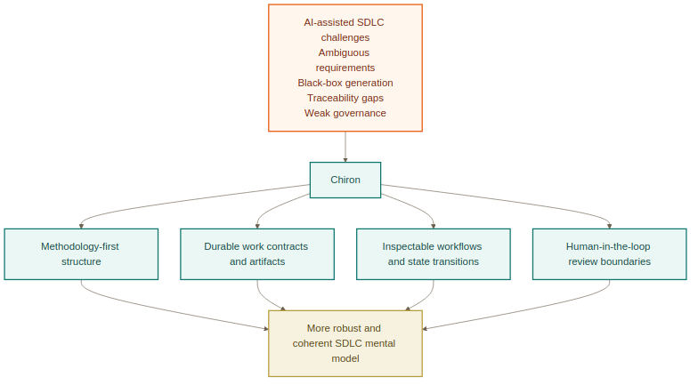
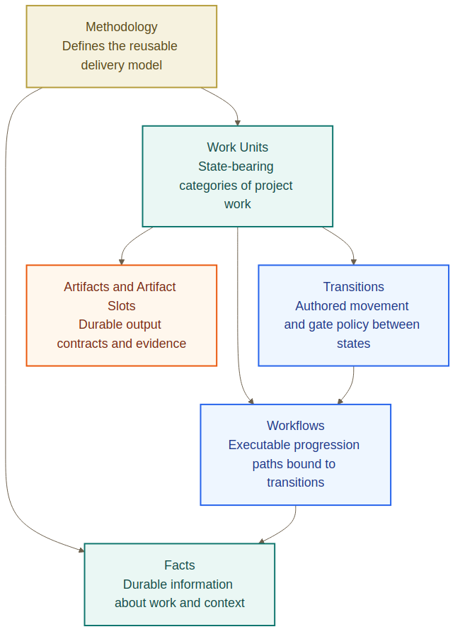
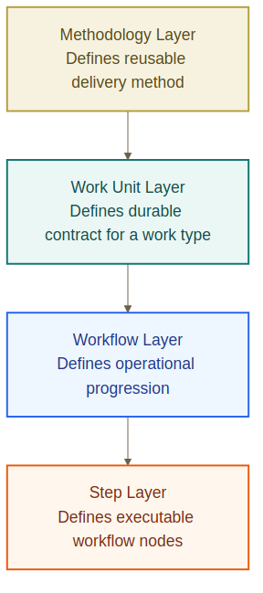
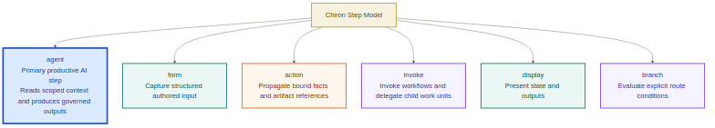
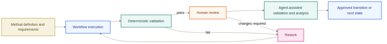

# Abstract

The increasing adoption of large language models and autonomous software agents in engineering practice has intensified a long-standing software development lifecycle (SDLC) problem: software delivery often remains weakly structured, difficult to inspect, and hard to govern once AI becomes an active participant in planning, implementation, and review. Existing AI-assisted workflows may produce locally useful outputs, yet they frequently preserve ambiguity in requirements, fragment traceability across artifacts, and weaken the relationship between generated code and accountable human oversight. This report argues that such conditions require not merely stronger models or broader tool access, but a more explicit lifecycle structure within which work, evidence, transitions, and review can be represented and governed.

Chiron is presented as a methodology-first response to this problem. Its central proposition is that agentic software delivery should be modeled as a system of durable and inspectable structures rather than as an informal chain of prompts, tool calls, and conversational state. The report situates Chiron within the literature on requirements engineering for AI-intensive systems, human-centered elicitation, AI governance, traceability, and the limitations of AI code generation. It then describes the conceptual and implementation design of Chiron, including its layered model, its distinction between design time and project runtime, and its use of explicit workflow and step structures. The report concludes that Chiron moves toward a more robust and coherent SDLC mental model by making delivery structure explicit, preserving human review boundaries, and treating inspectability as a core system property rather than a secondary convenience.

# Executive Summary

This report addresses a central challenge in contemporary software engineering: as AI agents become more capable, software delivery becomes easier to accelerate but harder to govern. The literature on requirements engineering for AI-based systems shows that traditional requirements practices are not yet fully adequate for probabilistic, data-driven, and rapidly evolving AI-intensive systems [1], [2]. Related work further indicates that traceability, oversight, artifact documentation, and human-centered elicitation remain unresolved concerns in many AI-enabled workflows [3], [7], [8], [9]. At the same time, empirical evidence on AI code generation demonstrates that plausible output quality does not eliminate the need for disciplined review, security scrutiny, and lifecycle control [5], [6].

Chiron is designed as a response to these concerns. Rather than treating software delivery as a conversation-centered process, it proposes a methodology-first model in which work is organized through durable layers, explicit workflow structures, typed step categories, and governance-aware review boundaries. The significance of Chiron, therefore, lies not merely in introducing AI into software development, but in using lifecycle structure to make AI-assisted development more accountable, inspectable, and coherent.

The report proceeds in five stages. First, it frames the research problem and research objectives. Second, it reviews relevant literature across AI-oriented requirements engineering, collaborative elicitation, AI governance, traceability, and code-generation limits. Third, it presents the methodological basis of the project as a design science-oriented artifact effort. Fourth, it describes the conceptual and implementation design of Chiron, including rendered conceptual figures that explain its layered structure, its design-time/runtime split, its step taxonomy, and its governance flow. Finally, it evaluates the contribution of Chiron as a proposed SDLC model and identifies its principal limitations and future directions.

# Introduction

## Purpose and Scope

The purpose of this report is to present and critically evaluate Chiron as a methodology-first system for AI-assisted software delivery. The report is concerned less with the narrow question of whether an AI system can produce code and more with the broader question of how software delivery should be structured once AI agents participate meaningfully in planning, implementation, validation, and review.

The scope of the report includes the conceptual problem that Chiron addresses, the relevant scholarly background, the methodological framing of the project, the system design of Chiron itself, and the extent to which that design supports a more robust and coherent SDLC model. The report does not assume that every envisioned subsystem or surface has been implemented to equal depth. Rather, it evaluates Chiron primarily as a designed artifact and as a structured response to a documented problem in AI-assisted software engineering.

## Problem Statement

Current AI-assisted software workflows often remain fundamentally chat-centric. Even when supported by sophisticated tools, much of the lifecycle is still carried by prompts, transient reasoning, generated snippets, and local interaction state. This creates a structural mismatch between the power of agentic tooling and the discipline expected from software engineering practice. Requirements may remain ambiguous, code-generation stages may function as black boxes, trace links may fracture across tools and artifacts, and human oversight may become retrospective rather than integral.

The problem is therefore not simply one of model capability. It is one of lifecycle representation. If software engineering is to remain governable under agentic conditions, then its work structures, transitions, evidence, and review points must be made more explicit than they are in typical assistant-driven workflows.

## Research Questions

This report is organized around the following research questions:

1. How can a methodology-first system help address known requirements-engineering and governance problems in AI-assisted software development?
2. In what ways can explicit lifecycle structures improve the coherence and inspectability of agentic software delivery?
3. How does Chiron operationalize design choices that respond to challenges identified in the literature on AI-intensive systems, traceability, and human oversight?

## Objectives

The project objectives corresponding to these questions are:

1. To design a lifecycle model for AI-assisted software delivery that makes work structure explicit.
2. To separate method definition from runtime execution so that delivery can be both authored and inspected.
3. To represent workflow progression, artifacts, facts, and review boundaries in durable form.
4. To preserve human-in-the-loop governance while still enabling agentic assistance and partial automation.

## Significance of the Study

The significance of the study lies in its focus on lifecycle structure rather than on model novelty alone. Much of the current discourse around AI-assisted software development is oriented toward productivity gains, developer convenience, or increasingly capable code-generation models. Chiron contributes a different perspective: that the central challenge of agentic software engineering is not only what models can do, but how their contributions can be situated inside a lifecycle that remains coherent, reviewable, and accountable.

# Background and Literature Review

## Requirements Engineering for AI-Intensive Systems

Recent work on requirements engineering for AI-intensive systems consistently shows that conventional requirements practices are strained by the characteristics of AI-based development. Ahmad et al. identify a wide range of requirements-related difficulties, including uncertainty, data dependency, explainability, and evolving non-functional requirements [1]. Habiba et al. reach a complementary conclusion, arguing that requirements engineering for AI-based systems remains immature as a field and continues to exhibit notable gaps in mature practices, cross-role coordination, and lifecycle integration [2].

Taken together, these studies suggest that the requirements problem in AI-assisted development is structural rather than incidental. The difficulty does not arise solely from poor tooling choices or isolated implementation errors. Rather, AI-based systems alter the conditions under which requirements are captured, refined, validated, and operationalized. This makes requirements engineering a foundational concern for any system that seeks to structure AI-assisted software delivery more responsibly.

## Human-Centered and Collaborative Elicitation

The literature also emphasizes that requirements quality is strongly shaped by the social and collaborative nature of elicitation. Ahmad et al. argue for human-centered requirements-engineering frameworks that explicitly incorporate stakeholder values and usability-oriented concerns when AI systems are involved [3]. Earlier collaborative work by Laporti, Borges, and Braganholo similarly shows that elicitation quality improves when stakeholders engage through explicit and shared structures rather than through fragmented exchanges [4].

The important point is not simply that collaboration is desirable. It is that collaboration must be made operational. Across these studies, the recurring concern is that stakeholder knowledge is easily lost when elicitation remains weakly structured. This is directly relevant to Chiron because the system is intended to reduce ambiguity by treating software delivery as an explicit method rather than as a sequence of isolated prompts. The literature therefore supports the view that structure in elicitation is not merely a usability enhancement, but a legitimate response to the collaborative demands of requirements work.

## Limitations of AI Code Generation

The recent literature on AI code generation further strengthens the case for stronger lifecycle governance. Pearce et al. demonstrate that code generated by GitHub Copilot in security-relevant contexts can frequently contain vulnerabilities, even when the output appears plausible or productive [5]. Their findings reinforce a central point of this report: syntactic fluency and short-term convenience do not eliminate the need for disciplined review.

Amershi et al., although focused more broadly on software engineering for machine learning systems, arrive at a related conclusion. They show that AI-enabled software development is fundamentally socio-technical and lifecycle-heavy, involving coordination burdens that extend well beyond isolated code output [6]. Read together, these studies suggest that AI assistance does not remove the need for engineering process. On the contrary, it intensifies the need to make that process explicit, reviewable, and durable.

## Traceability, Auditability, and Governance

A parallel strand of literature focuses on governance, documentation, and auditability. Mitchell et al. propose model cards as a structured means of reporting model characteristics, intended use, and evaluation boundaries [7]. Gebru et al. propose datasheets for datasets as an analogous mechanism for documenting dataset provenance, composition, intended use, and limitations [8]. Raji et al. extend this discussion by arguing that credible AI oversight requires structured audit ecosystems rather than informal internal claims of accountability [9].

What unifies these works is their insistence that responsible AI practice depends on explicit documentation structures. They collectively support a key assumption of this report: trustworthy AI-enabled systems require durable mechanisms for recording assumptions, tracing decisions, and supporting meaningful review. Chiron's emphasis on inspectability and explicit lifecycle representation aligns with this literature because it treats governance as a design concern rather than as a post hoc reporting exercise.

## Human-in-the-Loop Oversight

Human oversight remains central in the literature, not because AI systems are unusable without it, but because accountability and context-sensitive judgment cannot be delegated wholesale to model output. Pearce et al. show the security risks that follow from insufficient scrutiny of AI-generated code [5], while Raji et al. show that governance mechanisms require designed oversight structures rather than ad hoc trust [9].

The implication is clear. Human involvement should not be introduced only at the end of a pipeline as a final approval ritual. It should be integrated into the lifecycle itself. For this reason, Chiron is best understood not as a system that seeks to remove the human from software delivery, but as a system that seeks to formalize where and how human authority remains operative.

## Multi-Agent Orchestration as an Emerging Direction

Finally, research on multi-agent software-development systems suggests that structured coordination among specialized agents may improve decomposition and task handling. Qian et al., in ChatDev, show that communicative multi-agent arrangements can produce more organized development behavior than naive single-agent prompting [10]. At the same time, this line of work remains emergent rather than methodologically settled.

Accordingly, multi-agent orchestration in this report is treated as a promising but still experimental design direction. Its relevance lies not in replacing lifecycle structure, but in making lifecycle structure even more necessary. If multiple agents participate in a shared engineering process, then the need for explicit work boundaries, traceability, and review becomes more pressing rather than less.

# Research Methodology

## Research Design

This project follows a design science orientation. In design science research, the objective is not only to describe an existing phenomenon, but to create and evaluate an artifact intended to address a recognized class of problems [11]. Chiron fits this framing because it is developed as an artifact-level response to the governance and coherence problems of agentic software delivery.

## Overall Research Approach

The overall approach of the project is iterative and artifact-centered. The project first identifies a lifecycle problem in AI-assisted software engineering, then draws on the literature to clarify the dimensions of that problem, and finally develops a structured system intended to operationalize a response. In this sense, Chiron is both a software artifact and a conceptual argument. Its implementation matters, but its deeper contribution lies in the model of delivery that it embodies.

In practical development terms, the project also draws on BMAD as practitioner methodology context rather than as a formal scholarly method. Because BMAD is documented primarily through project documentation and community material rather than an established academic literature base, it is used here as implementation context for structured agent workflows, while the report's analytical grounding remains anchored in the broader literature on agentic software engineering, governance, and requirements engineering [10], [12].

## Data Collection and Analysis

Evidence for the project is drawn from two sources. The first is the external literature reviewed in this report, which provides the scholarly basis for framing the problem and assessing the significance of the response. The second is the implemented Chiron artifact itself, including its conceptual structures, interfaces, workflows, and generated figures. The analysis is therefore primarily qualitative and design-oriented rather than experimental in the narrow statistical sense.

## Evaluation Strategy

The evaluation strategy used here is analytical and artifact-based. The report evaluates Chiron by asking whether its design addresses the categories of concern raised in the literature: ambiguity in requirements, black-box generation, fragmented traceability, weak governance, and insufficient integration of human oversight. This does not claim final empirical proof of superiority over all alternative systems. Rather, it asks whether Chiron constitutes a credible and coherent designed response to a documented software-engineering problem.

## Risk Management and Ethical Considerations

The project also carries methodological and ethical risks. First, the artifact may overstate the degree to which structure alone can solve governance problems if actual deployment practices remain weak. Second, the project must avoid claiming maturity for surfaces that remain partial. Third, any AI-assisted lifecycle model should remain attentive to data provenance, transparency, and accountability concerns of the kind emphasized in the literature [8], [9]. These constraints inform the report's deliberately cautious treatment of limitations and scope.

# Chiron Methodology Model

## System Vision

Chiron is designed as a methodology-first system for AI-assisted software delivery. Its central premise is that agentic software engineering becomes more coherent only when the lifecycle itself is structured as a method rather than left to emerge from prompt chains, ad hoc tool calls, and unstable conversational state. In this sense, Chiron is not merely a shell around model execution. It is an attempt to define the entities, contracts, and progression rules that make agent work intelligible within a project.

The role of Chiron is therefore not merely to help generate code, but to provide a structured environment in which requirements, workflows, evidence, and oversight remain intelligible as AI agents participate in the lifecycle.

## Methodology as a Structured Delivery Model

At a conceptual level, Chiron responds to recurring weaknesses in AI-assisted development by converting informal delivery assumptions into explicit methodological entities. Requirements ambiguity is addressed through durable facts and work-unit contracts. Black-box generation is addressed through workflow and step-level visibility. Traceability gaps are addressed through artifacts, transitions, and stateful execution surfaces. Weak governance is addressed through explicit review boundaries and inspectable runtime behavior.

{ width=92% }

## Core Methodology Entities

The most important claim of Chiron is not simply that it has workflows, but that it defines a methodology vocabulary for software delivery. Each entity exists to solve a weakness in prompt-centric development.

### Methodology, Work Units, and Workflows

A **methodology** defines the reusable operating model for delivery. It establishes the vocabulary, the categories of work that exist, and the boundaries within which that work can progress. A **work unit** is the durable contract for one kind of work within that methodology. In practice, a work unit is best understood as a richer representation of a stateful work object: it has identity, cardinality, a current state, possible transitions, facts, and artifact expectations. A **workflow** is not a free-floating automation script that runs whenever convenient. It is the executable path through which a work unit performs or advances work under the policy of a transition. In current ownership terms, workflows belong within work-unit scope rather than floating independently at the methodology level.

This hierarchy matters because it prevents agentic work from degenerating into an undifferentiated task queue. Instead of asking only what the model should do next, Chiron first asks what kind of work exists, what contract governs it, and which workflow is valid for that contract.

### Facts, Transitions, and Artifacts

**Facts** are the durable information-bearing units through which context becomes explicit rather than conversational. Chiron distinguishes between methodology-level facts, work-unit facts, and workflow-context facts, allowing the system to preserve context at the level where it is semantically meaningful. Facts may change as work progresses, but they are not the same thing as the work unit's state. The **state** of a work unit is a separate lifecycle property that records where the work unit currently stands in its authored state machine. Facts describe the work unit; state locates the work unit in its lifecycle.

**Transitions** formalize movement between states and make progression an authored policy decision rather than an implicit judgment. A transition is not merely an arrow between two labels. It carries gate policy, readiness semantics, and explicit workflow bindings. This means that the system can evaluate whether a transition is eligible to start and, once active, whether it is ready to complete into the next state. In practical terms, workflows operate under transitions rather than outside them: they are bound to lifecycle movement and therefore inherit the discipline of transition policy.

**Artifacts** and **artifact slots** define durable output contracts. They ensure that outputs are preserved as governed evidence rather than disappearing into transient model responses.

Collectively, these entities transform delivery from a sequence of ephemeral exchanges into a method with explicit state, evidence, and movement semantics.

### Transition Gates and Workflow Binding

The relationship between states, transitions, and workflows is one of the most important parts of Chiron's methodology. A work unit can have many possible transitions, but a workflow does not simply run because it exists. Instead, workflows are explicitly bound to transitions. This means that workflow execution is lifecycle-scoped: the workflow runs in service of moving a work unit from one state toward another under authored policy.

The transition model also introduces gates at two distinct moments. First, there is the question of whether a transition is eligible to start. This is where start-gate conditions, dependency requirements, and bound-workflow readiness become relevant. Second, once a transition is active, there is the question of whether it is ready to complete. The runtime contract already reflects this distinction through concepts such as active transitions, possible transitions, start-gate inspection, and readiness-for-completion. This separation matters because it prevents lifecycle movement from being reduced to a single undifferentiated notion of readiness.

{ width=96% }

## The Four Layers of Chiron

The four-layer model remains useful, but it should be read as a structural decomposition of the methodology rather than as a flat diagram of interchangeable parts. The Methodology Layer defines the reusable delivery model. The Work Unit Layer defines durable work contracts. The Workflow Layer defines operational progression inside those contracts. The Step Layer defines the executable semantics through which workflows are enacted.

{ width=86% }

## Step Model and Execution Roles

Chiron defines an explicit step taxonomy, but the step types do not all play the same conceptual role. The **agent** step is the principal productive locus of AI work. The surrounding methodology exists largely to make that work coherent by scoping what the agent can read, what it can write, what counts as completion, and how its outputs become durable project state.

By contrast, the other step types provide structural support. **Form** captures structured input when the method requires explicit authored values. **Display** renders information for interpretation rather than mutating project state directly. **Branch** makes route conditions explicit and therefore prevents hidden control flow. **Action** is currently much narrower than a generic autonomous tool-execution concept; in implementation terms it is constrained to authored **propagation** actions over specific workflow context facts. **Invoke** is an orchestration bridge: it can start workflow targets in the current work-unit scope and also delegate into child work units when the method requires work-unit-level decomposition.

{ width=100% }

## Agent Step as the Core Productive Unit

The implementation-facing semantics make the centrality of the agent step clear. Agent-step authoring includes objective, instructions, harness and model selection, explicit read scope, explicit write scope, completion requirements, runtime policy, and guidance surfaces. At runtime, the agent step is not just a fire-and-forget model call. It owns session binding, state transitions, timeline visibility, readable context facts, controlled write items, and completion behavior. In practical terms, this means that the surrounding Chiron methodology is largely designed to ensure that agent work is contextualized, bounded, inspectable, and reviewable.

## Invoke and Action as Orchestration Steps

The implementation confirms that **invoke** is not limited to a generic “sub-workflow” label. Its canonical contract supports both self-scoped workflow invocation and child work-unit delegation. In child mode, invoke can activate a child work unit through a specified transition and maintain lineage between the invoking context and the created work. This makes invoke the step that connects local workflow execution to broader methodological decomposition.

The **action** step, by contrast, should not be described as an autonomous general-purpose execution step. Its current implementation is explicitly constrained to `actionKind: "propagation"`, operating over supported workflow context fact kinds such as bound facts and artifact-slot reference facts. In other words, action presently acts as a controlled propagation mechanism rather than as an unconstrained tool-using agent. This distinction matters because it changes how the step taxonomy should be interpreted in the report.

## Design Time and Project Runtime

Chiron distinguishes between two major contexts: design time and project runtime. Design time is where the method is authored. It is the context in which work-unit types, workflows, transitions, facts, and artifact expectations are defined. Project runtime is where that authored method is instantiated and observed as live project work. This distinction is conceptually significant because it allows Chiron to separate method definition from method execution while still keeping both visible inside the same system.

{ width=100% }

## Governance and Review Model

The final major design principle is governance through explicit review boundaries. Chiron's intended lifecycle does not treat validation as a single terminal check. Instead, it privileges formal progression through deterministic validation, human review, and agent-assisted review activities, all embedded inside a larger workflow structure.

# System Design and Implementation

## Architectural Realization

In implementation terms, Chiron realizes its conceptual model through an integrated set of design-time and runtime surfaces. The system provides authoring structures for methods and work contracts while also supporting runtime inspection of execution state and review-relevant evidence. This implementation is significant because it attempts to make the lifecycle model visible to its users rather than leaving it implicit in documentation or hidden system behavior.

## Workflow and Step Realization

The workflow and step model is realized through explicit workflow paths and typed step configurations. In implementation terms, this means that execution is not represented as a flat stream of assistant turns. Instead, the system materializes authored workflow topology, typed step definitions, runtime step executions, and associated detail surfaces that make the current state of work observable.

## Human Review and Validation Flow

At the implementation level, Chiron treats review and validation as part of the lifecycle rather than as a detached final judgment. Deterministic validation remains important for baseline correctness. Human review remains essential for governance and interpretation. Agent-assisted review may extend the evidence surface, but it does not remove the need for explicit progression criteria.

{ width=92% }

## Current Scope and Boundaries

The current implementation should be interpreted as a substantial but bounded realization of the conceptual model. Chiron's contribution in this report is not that every conceivable lifecycle surface is equally mature. Rather, it is that the system makes a serious and explicit attempt to embody a more inspectable, governable, and method-aware SDLC structure for AI-assisted delivery.

# Evaluation and Discussion

## How Chiron Responds to the Literature

When read against the literature reviewed earlier, Chiron can be understood as a direct response to several recognized problems. Requirements-engineering work for AI-intensive systems emphasizes ambiguity, emergent non-functional requirements, and cross-role coordination burdens [1], [2], [3]. Chiron responds by elevating methodology and work contracts into explicit structures. Governance and traceability research emphasizes documentation, provenance, and auditability [7], [8], [9]. Chiron responds by making lifecycle objects and review boundaries durable and inspectable. Empirical work on code-generation limits emphasizes the continued need for human review and disciplined engineering oversight [5], [6]. Chiron responds by refusing to treat generation as the whole lifecycle.

## Why It Supports a More Coherent SDLC Mental Model

The strongest argument for Chiron is that it restores conceptual separation where many AI-assisted workflows collapse distinct concerns. It distinguishes method definition from method execution, work contracts from workflow movement, and workflow progression from step semantics. This separation improves coherence because it gives teams a shared model for reasoning about what kind of work exists, how it should move, what artifacts matter, and where review should occur.

## Strengths

Three strengths are especially important. First, Chiron is explicit about lifecycle structure. Second, it places inspectability at the center of the system rather than at the margins. Third, it preserves human-in-the-loop governance as a built-in lifecycle concern rather than as an afterthought. These strengths give it conceptual significance even where full platform maturity remains incomplete.

## Limitations

The main limitation is that a well-structured conceptual model does not by itself establish universal operational superiority. Chiron should therefore be read as a serious artifact proposal and implementation effort, not as a final or universally validated endpoint for agentic SDLC design. A second limitation is that some aspects of agentic software engineering remain emergent in the literature itself, especially in multi-agent orchestration [10]. A third limitation is that future evaluation questions, including comparative user studies and controlled process experiments, remain open.

## Threats to Validity

The primary threat to validity is interpretive. Because this report is design-oriented, its evaluation depends on whether the conceptual problem is framed correctly and whether the artifact's structure addresses that problem plausibly. Another threat is temporal: both AI-assisted development practice and the associated literature are evolving rapidly. Finally, there is a scope threat. Chiron is intended as a methodology-first lifecycle system, so evaluations focused purely on immediate code-generation throughput would capture only part of its contribution.

# Conclusion and Future Work

This report has argued that the central challenge of agentic software engineering is not merely to obtain more capable AI assistance, but to create a lifecycle structure within which such assistance remains intelligible, governable, and reviewable. The literature shows that AI-intensive systems complicate requirements engineering, increase the importance of traceability and documentation, and do not remove the need for human oversight [1], [5], [7], [8], [9].

Chiron is presented as a response to this challenge. Its contribution lies in treating software delivery as a structured and inspectable method rather than as a sequence of disconnected agent interactions. Through its layered model, its distinction between design time and project runtime, its typed step taxonomy, and its governance-oriented review flow, Chiron moves toward a more robust and coherent SDLC mental model for the age of agentic development.

Future work should focus on deeper empirical evaluation, broader user studies, comparative process analysis, and continued refinement of the relationship between lifecycle structure and multi-agent coordination. The long-term significance of Chiron will depend not only on what the system implements, but also on whether its model of software delivery helps define a more trustworthy way of working with AI in software engineering practice.

# References

[1] K. Ahmad, M. Abdelrazek, C. Arora, M. Bano, and J. Grundy, "Requirements engineering for artificial intelligence systems: A systematic mapping study," *Inf. Softw. Technol.*, vol. 158, Art. no. 107176, 2023, doi: 10.1016/j.infsof.2023.107176.

[2] U. Habiba, M. Haug, J. Bogner, and S. Wagner, "How mature is requirements engineering for AI-based systems? A systematic mapping study on practices, challenges, and future research directions," *Requirements Eng.*, early access, 2024. [Online]. Available: <https://doi.org/10.48550/arXiv.2409.07192>

[3] K. Ahmad, M. Abdelrazek, C. Arora, A. A. Baniya, M. Bano, and J. Grundy, "Requirements engineering framework for human-centered artificial intelligence software systems," arXiv preprint, 2023. [Online]. Available: <https://doi.org/10.48550/arXiv.2303.02920>

[4] V. Laporti, M. R. S. Borges, and V. Braganholo, "Athena: A collaborative approach to requirements elicitation," *Comput. Ind.*, vol. 60, no. 6, pp. 367-380, 2009, doi: 10.1016/j.compind.2009.02.011.

[5] H. Pearce, B. Ahmad, B. Tan, B. Dolan-Gavitt, and R. Karri, "Asleep at the keyboard? Assessing the security of GitHub Copilot's code contributions," in *Proc. IEEE Symp. Secur. Privacy (SP)*, 2022, pp. 754-768, doi: 10.1109/SP46214.2022.9833571.

[6] S. Amershi, A. Begel, C. Bird, R. DeLine, H. Gall, E. Kamar, N. Nagappan, B. Nushi, and T. Zimmermann, "Software engineering for machine learning: A case study," in *Proc. IEEE/ACM 41st Int. Conf. Softw. Eng.: Softw. Eng. Pract. (ICSE-SEIP)*, 2019, pp. 291-300, doi: 10.1109/ICSE-SEIP.2019.00042.

[7] M. Mitchell, S. Wu, A. Zaldivar, P. Barnes, L. Vasserman, B. Hutchinson, E. Spitzer, I. D. Raji, and T. Gebru, "Model cards for model reporting," in *Proc. Conf. Fairness, Accountability, Transparency (FAT*)*, 2019, doi: 10.1145/3287560.3287596.

[8] T. Gebru, J. Morgenstern, B. Vecchione, J. W. Vaughan, H. Wallach, H. Daumé III, and K. Crawford, "Datasheets for datasets," *Commun. ACM*, vol. 64, no. 12, pp. 86-92, 2021, doi: 10.1145/3458723.

[9] I. D. Raji, P. Xu, C. Honigsberg, and D. E. Ho, "Outsider oversight: Designing a third party audit ecosystem for AI governance," in *Proc. AAAI/ACM Conf. AI, Ethics, Soc.* 2022, pp. 557-571, doi: 10.1145/3514094.3534181.

[10] C. Qian, W. Liu, H. Liu, N. Chen, Y. Dang, J. Li, C. Yang, W. Chen, Y. Su, X. Cong, J. Xu, D. Li, Z. Liu, and M. Sun, "ChatDev: Communicative agents for software development," in *Proc. 62nd Annu. Meeting Assoc. Comput. Linguistics (ACL)*, 2024. [Online]. Available: <https://doi.org/10.48550/arXiv.2307.07924>

[11] A. R. Hevner, S. T. March, J. Park, and S. Ram, "Design science in information systems research," *MIS Q.*, vol. 28, no. 1, pp. 75-105, 2004, doi: 10.2307/25148625.

[12] BMad Method, "Framework overview," 2026. [Online]. Available: <https://bmad-code-org-bmad-method-6.mintlify.app/concepts/framework-overview>

# Appendix A. Figure Inventory

1. Figure 1: Chiron as a response to common lifecycle weaknesses in AI-assisted software development.
2. Figure 2: Methodology entity model.
3. Figure 3: The four-layer structure of Chiron.
4. Figure 4: Step model centered on the agent step.
5. Figure 5: Design time and project runtime separation.
6. Figure 6: Governance and validation flow.
