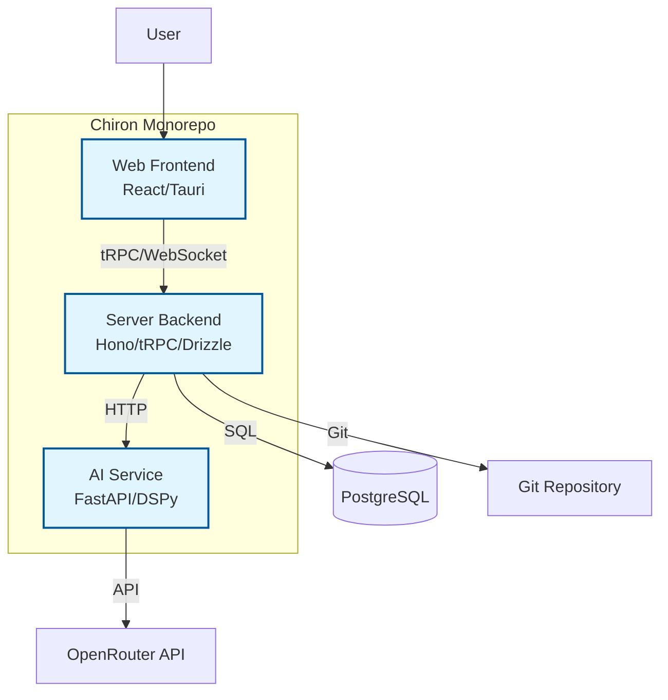
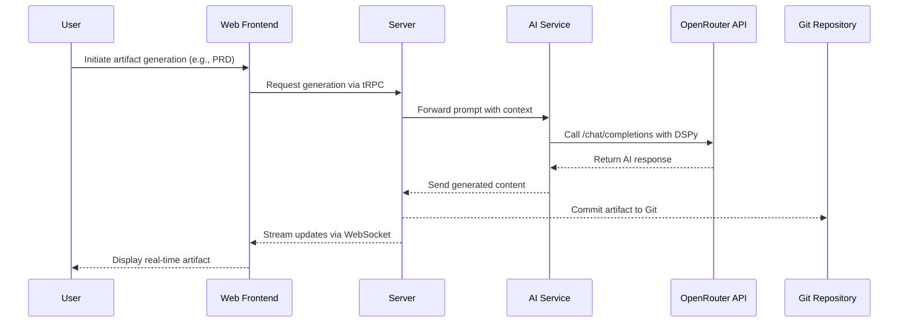
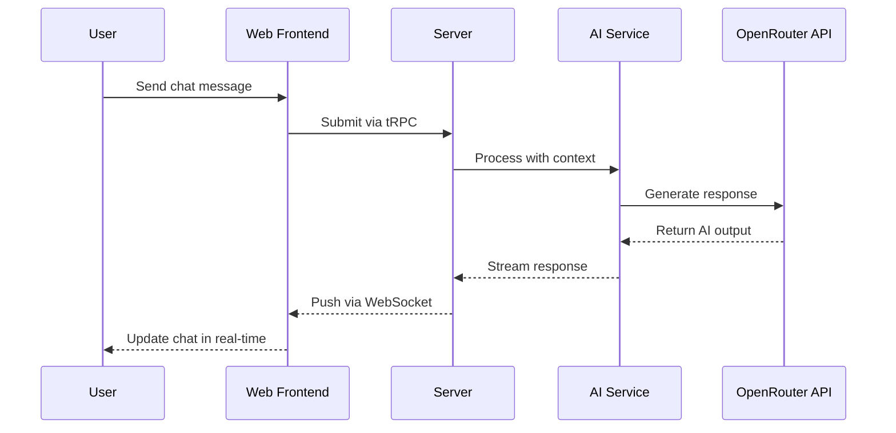

## Data Models

Based on the PRD requirements, key business entities include projects, artifacts (BMAD documents), chat history, users, and usage tracking. Here's the conceptual model for core entities:

#### Project

**Purpose:** Represents a development project with associated artifacts, chat history, and metadata.

**Key Attributes:**
- id: string - Unique project identifier
- name: string - Project name
- description: string - Project description
- createdAt: timestamp - Creation date
- updatedAt: timestamp - Last update date
- status: enum (active, archived, deleted) - Project status

**Relationships:**
- Has many Artifacts
- Has many ChatConversations
- Belongs to User (owner)

#### Artifact

**Purpose:** Represents BMAD documents (PRD, Architecture, etc.) with versioning and content.

**Key Attributes:**
- id: string - Unique artifact identifier
- type: enum (brief, prd, architecture, epic, story) - Artifact type
- title: string - Artifact title
- content: text - Markdown content
- version: string - Version number
- createdAt: timestamp - Creation date
- updatedAt: timestamp - Last update date
- projectId: string - Associated project

**Relationships:**
- Belongs to Project
- Has many Versions (if needed)

#### ChatConversation

**Purpose:** Represents AI chat conversations with history and metadata.

**Key Attributes:**
- id: string - Unique conversation identifier
- projectId: string - Associated project
- modelUsed: string - AI model identifier
- messages: array - List of chat messages
- createdAt: timestamp - Start date
- updatedAt: timestamp - Last message date

**Relationships:**
- Belongs to Project
- Has many ChatMessages

#### User

**Purpose:** Represents system users with authentication and preferences.

**Key Attributes:**
- id: string - Unique user identifier
- email: string - User email
- apiKeys: encrypted - OpenRouter API keys
- preferences: object - Model defaults, settings
- createdAt: timestamp - Account creation date

**Relationships:**
- Has many Projects

**Detailed Rationale for Data Models Section:**
- **Trade-offs and Choices:** Focused on core entities from PRD (projects, artifacts, chat); kept simple to start but repeatable for expansion. Used relational model for PostgreSQL alignment.
- **Key Assumptions:** Assumed user management is basic; if multi-user collaboration needed, expand User model.
- **Interesting Decisions:** Separated ChatConversation from messages for scalability; tied everything to Project for organization.
- **Areas for Validation:** Confirm if additional entities (e.g., Epics/Stories as separate) are needed beyond Artifact type enum.

## Components

Based on the architectural patterns, tech stack, and data models, the major logical components are the three services in the monorepo: AI Service, Server, and Web Frontend. Here's the component breakdown:

#### AI Service Component

**Responsibility:** Handles AI orchestration using DSPy and OpenRouter, processes prompts, generates BMAD artifacts, manages file uploads via attachments library.

**Key Interfaces:**
- /generate (POST) - Generate AI responses
- /upload (POST) - Handle file uploads
- /models (GET) - Retrieve available models

**Dependencies:** OpenRouter API, DSPy framework, attachments library, communicates with Server for data.

**Technology Stack:** Python 3.11+, FastAPI 0.104.0+, DSPy 2.5.0, Attachments 1.0.0, Uvicorn 0.24.0+

#### Server Component

**Responsibility:** Manages backend logic, database operations, tRPC API, real-time WebSocket updates, Git integration for artifacts.

**Key Interfaces:**
- /trpc/* (POST/GET) - tRPC endpoints for CRUD operations
- /api/health (GET) - Health check
- WebSocket /ws - Real-time updates

**Dependencies:** Database (PostgreSQL), Git repository, communicates with AI Service and Web.

**Technology Stack:** TypeScript 5.8.2, Bun 1.2.22, Hono 4.8.2, tRPC 11.5.0, Drizzle ORM 0.44.2, Zod 4.0.2

#### Web Component

**Responsibility:** Provides cross-platform desktop UI, split-screen workspace, chat interface, artifact display, Kanban boards.

**Key Interfaces:**
- / (GET) - Main app interface
- Integrates with Server via tRPC and WebSocket

**Dependencies:** Server for data, Tauri for desktop wrapper.

**Technology Stack:** React 19.1.0, TanStack Router 1.114.25, Tailwind CSS 4.0.15, Tauri 2.4.0, TanStack Query 5.85.5

#### Component Diagrams



**Detailed Rationale for Components Section:**
- **Trade-offs and Choices:** Kept to three main components per PRD microservices pattern; could split further if needed for scalability.
- **Key Assumptions:** Assumed clear boundaries with Server as orchestrator; AI isolated as per PRD.
- **Interesting Decisions:** Web as desktop app via Tauri for native features; AI service in Python for DSPy compatibility.
- **Areas for Validation:** Verify if additional shared components (e.g., utilities) are needed.

## External APIs

The project requires external API integrations, primarily OpenRouter for AI functionality.

#### OpenRouter API

- **Purpose:** Primary AI provider for LLM access, model management, and chat completions.
- **Documentation:** https://openrouter.ai/docs
- **Base URL(s):** https://openrouter.ai/api/v1
- **Authentication:** Bearer token with API key
- **Rate Limits:** Provider-specific (e.g., requests per minute based on plan); implement retry logic.

**Key Endpoints Used:**
- `GET /models` - Retrieve available models
- `POST /chat/completions` - Generate chat responses

**Integration Notes:** Integrated via AI SDK in server and DSPy in AI service; handle errors, retries, and usage tracking per PRD.

**Detailed Rationale for External APIs Section:**
- **Trade-offs and Choices:** Focused on OpenRouter as per PRD; could add fallbacks if needed.
- **Key Assumptions:** Assumed API stability; monitor for changes.
- **Interesting Decisions:** Centralized in AI service for isolation.
- **Areas for Validation:** Confirm rate limits and add more endpoints if required.

## Core Workflows

Key system workflows include BMAD artifact generation and real-time chat interaction.

#### BMAD Artifact Generation Workflow



#### Real-Time Chat Interaction Workflow



**Detailed Rationale for Core Workflows Section:**
- **Trade-offs and Choices:** Focused on critical paths from PRD; kept diagrams high-level for clarity.
- **Key Assumptions:** Assumed WebSocket for real-time; if performance issues, optimize.
- **Interesting Decisions:** Streaming responses for better UX.
- **Areas for Validation:** Verify if additional workflows (e.g., file upload) are needed.

## Database Schema

Transforming the conceptual data models into PostgreSQL schema using Drizzle ORM TypeScript definitions, now including interactive elements, undo support, and DSPy structures:

```typescript
import { pgTable, text, timestamp, jsonb, integer, pgEnum, boolean } from 'drizzle-orm/pg-core';

// Enums
const projectStatusEnum = pgEnum('project_status', ['active', 'archived', 'deleted', 'brownfield', 'greenfield']);
const projectPhaseEnum = pgEnum('project_phase', ['planning', 'implementation']);
const artifactTypeEnum = pgEnum('artifact_type', ['brief', 'prd', 'architecture', 'epic', 'story']);
const messageRoleEnum = pgEnum('message_role', ['user', 'assistant']);
const listTypeEnum = pgEnum('list_type', ['sequential', 'independent', 'choice']);
const interactionTypeEnum = pgEnum('interaction_type', ['answer', 'clarify', 'skip', 'custom']);

// Users table (unchanged)
export const users = pgTable('users', {
  id: text('id').primaryKey(),
  email: text('email').unique().notNull(),
  apiKeys: jsonb('api_keys'), // Encrypted API keys
  preferences: jsonb('preferences'),
  createdAt: timestamp('created_at').defaultNow(),
  updatedAt: timestamp('updated_at').defaultNow(),
});

// Projects table (unchanged)
export const projects = pgTable('projects', {
  id: text('id').primaryKey(),
  name: text('name').notNull(),
  description: text('description'),
  status: projectStatusEnum('status').default('active'),
  percentageDone: integer('percentage_done').default(0), // 0-100 progress
  currentPhase: projectPhaseEnum('current_phase').default('planning'), // planning or implementation
  userId: text('user_id').references(() => users.id, { onDelete: 'cascade' }),
  createdAt: timestamp('created_at').defaultNow(),
  updatedAt: timestamp('updated_at').defaultNow(),
});

// Artifacts table (now with versioning for undo)
export const artifacts = pgTable('artifacts', {
  id: text('id').primaryKey(),
  type: artifactTypeEnum('type').notNull(),
  title: text('title').notNull(),
  content: text('content').notNull(),
  version: text('version').notNull(),
  projectId: text('project_id').references(() => projects.id, { onDelete: 'cascade' }),
  createdAt: timestamp('created_at').defaultNow(),
  updatedAt: timestamp('updated_at').defaultNow(),
});

// Artifact versions for undo
export const artifactVersions = pgTable('artifact_versions', {
  id: text('id').primaryKey(),
  artifactId: text('artifact_id').references(() => artifacts.id, { onDelete: 'cascade' }),
  content: text('content').notNull(),
  version: text('version').notNull(),
  timestamp: timestamp('timestamp').defaultNow(),
});

// Chat conversations table (unchanged)
export const chatConversations = pgTable('chat_conversations', {
  id: text('id').primaryKey(),
  projectId: text('project_id').references(() => projects.id, { onDelete: 'cascade' }),
  modelUsed: text('model_used').notNull(),
  createdAt: timestamp('created_at').defaultNow(),
  updatedAt: timestamp('updated_at').defaultNow(),
});

// Chat messages table (now with versioning for undo)
export const chatMessages = pgTable('chat_messages', {
  id: text('id').primaryKey(),
  conversationId: text('conversation_id').references(() => chatConversations.id, { onDelete: 'cascade' }),
  role: messageRoleEnum('role').notNull(),
  content: text('content').notNull(),
  timestamp: timestamp('timestamp').defaultNow(),
  isActive: boolean('is_active').default(true), // For soft delete/undo
});

// Message versions for undo
export const messageVersions = pgTable('message_versions', {
  id: text('id').primaryKey(),
  messageId: text('message_id').references(() => chatMessages.id, { onDelete: 'cascade' }),
  content: text('content').notNull(),
  timestamp: timestamp('timestamp').defaultNow(),
});

// Interactive lists for enhanced chat
export const interactiveLists = pgTable('interactive_lists', {
  id: text('id').primaryKey(),
  conversationId: text('conversation_id').references(() => chatConversations.id, { onDelete: 'cascade' }),
  type: listTypeEnum('type').notNull(), // sequential, independent, choice
  title: text('title'),
  createdAt: timestamp('created_at').defaultNow(),
});

// List items
export const listItems = pgTable('list_items', {
  id: text('id').primaryKey(),
  listId: text('list_id').references(() => interactiveLists.id, { onDelete: 'cascade' }),
  content: text('content').notNull(),
  order: integer('order').notNull(),
  isCompleted: boolean('is_completed').default(false),
  response: text('response'), // User's answer/clarification
});

// User interactions (modals/dialogs)
export const interactions = pgTable('interactions', {
  id: text('id').primaryKey(),
  conversationId: text('conversation_id').references(() => chatConversations.id, { onDelete: 'cascade' }),
  type: interactionTypeEnum('type').notNull(),
  itemId: text('item_id').references(() => listItems.id), // Related list item
  data: jsonb('data'), // Additional interaction data (e.g., modal inputs)
  timestamp: timestamp('timestamp').defaultNow(),
});

// DSPy signatures for structured workflows
export const dspySignatures = pgTable('dspy_signatures', {
  id: text('id').primaryKey(),
  name: text('name').notNull(),
  description: text('description'),
  inputFields: jsonb('input_fields'), // Schema for inputs
  outputFields: jsonb('output_fields'), // Schema for outputs
  projectId: text('project_id').references(() => projects.id, { onDelete: 'cascade' }),
  createdAt: timestamp('created_at').defaultNow(),
});

// Indexes for performance
// (Drizzle handles these via schema definitions or migrations)
```

**Updated Rationale for Database Schema Section:**
- **Trade-offs and Choices:** Added interactive and undo support to align with PRD chat features and OpenCode-like functionality; DSPy table for structured AI.
- **Key Assumptions:** Undo via soft deletes and versions; interactions tied to conversations for context.
- **Interesting Decisions:** Versioning enables undo without full history bloat; DSPy signatures make workflows reusable.
- **Areas for Validation:** Confirm if more fields for DSPy or interaction types are needed.

## Source Tree

Based on the monorepo structure, repository structure (monorepo), service architecture (microservices within monorepo), and tech stack:

```
chiron-monorepo/
├── apps/
│   ├── ai-service/                    # Python AI service with DSPy
│   │   ├── app/
│   │   │   ├── main.py                # FastAPI app entry
│   │   │   ├── routers/               # API routes
│   │   │   └── modules/               # DSPy modules and signatures
│   │   ├── tests/                     # Pytest tests
│   │   ├── pyproject.toml             # Python dependencies
│   │   └── README.md
│   ├── server/                        # Node.js backend with Hono/tRPC
│   │   ├── src/
│   │   │   ├── index.ts               # Hono app entry
│   │   │   ├── routers/               # tRPC routes
│   │   │   ├── db/                    # Drizzle schemas and migrations
│   │   │   └── lib/                   # Utilities (context, validation)
│   │   ├── tests/                     # Unit/integration tests
│   │   ├── package.json
│   │   └── README.md
│   └── web/                           # React/Tauri frontend
│       ├── src/
│       │   ├── components/            # UI components (buttons, dialogs)
│       │   ├── routes/                # TanStack Router pages
│       │   ├── lib/                   # Utilities (tRPC client, utils)
│       │   └── utils/                 # Shared helpers
│       ├── src-tauri/                 # Tauri desktop wrapper
│       │   ├── src/                   # Rust backend for Tauri
│       │   └── Cargo.toml
│       ├── tests/                     # Frontend tests
│       ├── package.json
│       └── README.md
├── packages/                          # Shared packages (if needed)
│   └── shared/                        # Common types, utils
├── docs/                              # BMAD artifacts and docs
│   ├── architecture.md
│   ├── prd.md
│   └── ...
├── .bmad-core/                        # BMAD configuration
├── turbo.json                         # Turbo monorepo config
├── package.json                       # Root package.json
└── README.md
```

**Detailed Rationale for Source Tree Section:**
- **Trade-offs and Choices:** Mirrors existing structure for brownfield; clear separation by service.
- **Key Assumptions:** Assumed no additional packages yet; can add if shared code grows.
- **Interesting Decisions:** Docs at root for easy access; .bmad-core for methodology config.
- **Areas for Validation:** Confirm if more nesting (e.g., in ai-service modules) is needed.
