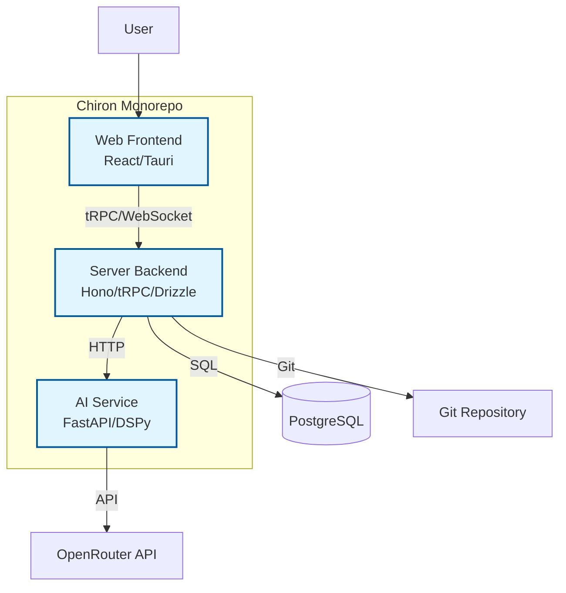

## Monitoring and Observability

### 1. Health Check System

**Comprehensive Health Monitoring:**
```typescript
interface HealthCheck {
    name: string;
    status: 'healthy' | 'unhealthy' | 'degraded';
    message?: string;
    responseTime?: number;
    lastChecked: Date;
}

interface SystemHealth {
    overall: 'healthy' | 'unhealthy' | 'degraded';
    services: HealthCheck[];
    timestamp: Date;
    version: string;
}

class HealthCheckService {
    private checks: Map<string, () => Promise<HealthCheck>> = new Map();
    
    constructor() {
        this.registerChecks();
    }
    
    private registerChecks(): void {
        // Database health check
        this.checks.set('database', async () => {
            const start = Date.now();
            try {
                await db.execute(sql`SELECT 1`);
                return {
                    name: 'database',
                    status: 'healthy',
                    responseTime: Date.now() - start,
                    lastChecked: new Date()
                };
            } catch (error) {
                return {
                    name: 'database',
                    status: 'unhealthy',
                    message: error.message,
                    lastChecked: new Date()
                };
            }
        });
        
        // Redis health check
        this.checks.set('redis', async () => {
            const start = Date.now();
            try {
                await redis.ping();
                return {
                    name: 'redis',
                    status: 'healthy',
                    responseTime: Date.now() - start,
                    lastChecked: new Date()
                };
            } catch (error) {
                return {
                    name: 'redis',
                    status: 'unhealthy',
                    message: error.message,
                    lastChecked: new Date()
                };
            }
        });
        
        // AI service health check
        this.checks.set('ai-service', async () => {
            const start = Date.now();
            try {
                const response = await fetch(`${process.env.AI_SERVICE_URL}/health`);
                const data = await response.json();
                
                return {
                    name: 'ai-service',
                    status: data.status === 'healthy' ? 'healthy' : 'unhealthy',
                    responseTime: Date.now() - start,
                    lastChecked: new Date()
                };
            } catch (error) {
                return {
                    name: 'ai-service',
                    status: 'unhealthy',
                    message: error.message,
                    lastChecked: new Date()
                };
            }
        });
        
        // OpenRouter API health check
        this.checks.set('openrouter', async () => {
            const start = Date.now();
            try {
                const response = await fetch('https://openrouter.ai/api/v1/models', {
                    method: 'HEAD',
                    timeout: 5000
                });
                
                return {
                    name: 'openrouter',
                    status: response.ok ? 'healthy' : 'unhealthy',
                    responseTime: Date.now() - start,
                    lastChecked: new Date()
                };
            } catch (error) {
                return {
                    name: 'openrouter',
                    status: 'unhealthy',
                    message: error.message,
                    lastChecked: new Date()
                };
            }
        });
    }
    
    async getSystemHealth(): Promise<SystemHealth> {
        const checks = await Promise.all(
            Array.from(this.checks.values()).map(check => check())
        );
        
        const unhealthyChecks = checks.filter(check => check.status === 'unhealthy');
        const degradedChecks = checks.filter(check => check.status === 'degraded');
        
        let overall: 'healthy' | 'unhealthy' | 'degraded' = 'healthy';
        
        if (unhealthyChecks.length > 0) {
            overall = 'unhealthy';
        } else if (degradedChecks.length > 0) {
            overall = 'degraded';
        }
        
        return {
            overall,
            services: checks,
            timestamp: new Date(),
            version: process.env.npm_package_version || 'unknown'
        };
    }
}

// Health check endpoint
app.get('/health', async (c) => {
    const healthService = new HealthCheckService();
    const health = await healthService.getSystemHealth();
    
    const statusCode = health.overall === 'healthy' ? 200 : 503;
    
    return c.json(health, statusCode);
});
```

### 2. Metrics and Analytics

**Performance Metrics Collection:**
```typescript
interface PerformanceMetrics {
    requestDuration: number;
    responseSize: number;
    statusCode: number;
    endpoint: string;
    method: string;
    userId?: string;
    timestamp: Date;
}

class MetricsCollector {
    private metrics: PerformanceMetrics[] = [];
    private flushInterval: number = 60000; // 1 minute
    
    constructor() {
        this.startPeriodicFlush();
    }
    
    recordRequest(metrics: PerformanceMetrics): void {
        this.metrics.push(metrics);
        
        // Flush if buffer is getting large
        if (this.metrics.length > 1000) {
            this.flushMetrics();
        }
    }
    
    private startPeriodicFlush(): void {
        setInterval(() => {
            this.flushMetrics();
        }, this.flushInterval);
    }
    
    private async flushMetrics(): Promise<void> {
        if (this.metrics.length === 0) return;
        
        const metricsToFlush = [...this.metrics];
        this.metrics = [];
        
        try {
            // Send metrics to analytics service
            await this.sendMetricsToAnalytics(metricsToFlush);
        } catch (error) {
            console.error('Failed to flush metrics:', error);
            // Put metrics back in queue for retry
            this.metrics.unshift(...metricsToFlush);
        }
    }
    
    private async sendMetricsToAnalytics(metrics: PerformanceMetrics[]): Promise<void> {
        // Implementation depends on your analytics service
        // Could be Google Analytics, Mixpanel, or custom service
        
        const aggregatedMetrics = this.aggregateMetrics(metrics);
        
        // Store in database for internal analytics
        await db.insert(performanceMetrics).values(
            aggregatedMetrics.map(metric => ({
                endpoint: metric.endpoint,
                avgResponseTime: metric.avgResponseTime,
                p95ResponseTime: metric.p95ResponseTime,
                errorRate: metric.errorRate,
                requestCount: metric.requestCount,
                timestamp: new Date()
            }))
        );
    }
    
    private aggregateMetrics(metrics: PerformanceMetrics[]): AggregatedMetrics[] {
        const grouped = new Map<string, PerformanceMetrics[]>();
        
        metrics.forEach(metric => {
            const key = `${metric.method}:${metric.endpoint}`;
            if (!grouped.has(key)) {
                grouped.set(key, []);
            }
            grouped.get(key)!.push(metric);
        });
        
        return Array.from(grouped.entries()).map(([key, group]) => {
            const responseTimes = group.map(m => m.requestDuration).sort((a, b) => a - b);
            const p95Index = Math.floor(responseTimes.length * 0.95);
            
            return {
                endpoint: key,
                avgResponseTime: responseTimes.reduce((a, b) => a + b, 0) / responseTimes.length,
                p95ResponseTime: responseTimes[p95Index],
                errorRate: group.filter(m => m.statusCode >= 400).length / group.length,
                requestCount: group.length
            };
        });
    }
}

// Middleware to collect metrics
export function metricsMiddleware(): Middleware {
    return async (c, next) => {
        const start = Date.now();
        
        await next();
        
        const end = Date.now();
        const duration = end - start;
        
        const metrics: PerformanceMetrics = {
            requestDuration: duration,
            responseSize: Number(c.res.headers.get('content-length') || 0),
            statusCode: c.res.status,
            endpoint: c.req.path,
            method: c.req.method,
            userId: c.get('userId'),
            timestamp: new Date()
        };
        
        const collector = new MetricsCollector();
        collector.recordRequest(metrics);
    };
}
```

## Data Models

Based on the PRD requirements, key business entities include projects, artifacts (BMAD documents), chat history, users, and usage tracking. Here's the conceptual model for core entities:

#### Project

**Purpose:** Represents a development project with associated artifacts, chat history, and metadata.

**Key Attributes:**
- id: string - Unique project identifier
- name: string - Project name
- description: string - Project description
- createdAt: timestamp - Creation date
- updatedAt: timestamp - Last update date
- status: enum (active, archived, deleted) - Project status

**Relationships:**
- Has many Artifacts
- Has many ChatConversations
- Belongs to User (owner)

#### Artifact

**Purpose:** Represents BMAD documents (PRD, Architecture, etc.) with versioning and content.

**Key Attributes:**
- id: string - Unique artifact identifier
- type: enum (brief, prd, architecture, epic, story) - Artifact type
- title: string - Artifact title
- content: text - Markdown content
- version: string - Version number
- createdAt: timestamp - Creation date
- updatedAt: timestamp - Last update date
- projectId: string - Associated project

**Relationships:**
- Belongs to Project
- Has many Versions (if needed)

#### ChatConversation

**Purpose:** Represents AI chat conversations with history and metadata.

**Key Attributes:**
- id: string - Unique conversation identifier
- projectId: string - Associated project
- modelUsed: string - AI model identifier
- messages: array - List of chat messages
- createdAt: timestamp - Start date
- updatedAt: timestamp - Last message date

**Relationships:**
- Belongs to Project
- Has many ChatMessages

#### User

**Purpose:** Represents system users with authentication and preferences.

**Key Attributes:**
- id: string - Unique user identifier
- email: string - User email
- apiKeys: encrypted - OpenRouter API keys
- preferences: object - Model defaults, settings
- createdAt: timestamp - Account creation date

**Relationships:**
- Has many Projects

**Detailed Rationale for Data Models Section:**
- **Trade-offs and Choices:** Focused on core entities from PRD (projects, artifacts, chat); kept simple to start but repeatable for expansion. Used relational model for PostgreSQL alignment.
- **Key Assumptions:** Assumed user management is basic; if multi-user collaboration needed, expand User model.
- **Interesting Decisions:** Separated ChatConversation from messages for scalability; tied everything to Project for organization.
- **Areas for Validation:** Confirm if additional entities (e.g., Epics/Stories as separate) are needed beyond Artifact type enum.

## Components

Based on the architectural patterns, tech stack, and data models, the major logical components are the three services in the monorepo: AI Service, Server, and Web Frontend. Here's the component breakdown:

#### AI Service Component

**Responsibility:** Handles AI orchestration using DSPy and OpenRouter, processes prompts, generates BMAD artifacts, manages file uploads via attachments library.

**Key Interfaces:**
- /generate (POST) - Generate AI responses
- /upload (POST) - Handle file uploads
- /models (GET) - Retrieve available models

**Dependencies:** OpenRouter API, DSPy framework, attachments library, communicates with Server for data.

**Technology Stack:** Python 3.11+, FastAPI 0.104.0+, DSPy 2.5.0, Attachments 1.0.0, Uvicorn 0.24.0+

#### Server Component

**Responsibility:** Manages backend logic, database operations, tRPC API, real-time WebSocket updates, Git integration for artifacts.

**Key Interfaces:**
- /trpc/* (POST/GET) - tRPC endpoints for CRUD operations
- /api/health (GET) - Health check
- WebSocket /ws - Real-time updates

**Dependencies:** Database (PostgreSQL), Git repository, communicates with AI Service and Web.

**Technology Stack:** TypeScript 5.8.2, Bun 1.2.22, Hono 4.8.2, tRPC 11.5.0, Drizzle ORM 0.44.2, Zod 4.0.2

#### Web Component

**Responsibility:** Provides cross-platform desktop UI, split-screen workspace, chat interface, artifact display, Kanban boards.

**Key Interfaces:**
- / (GET) - Main app interface
- Integrates with Server via tRPC and WebSocket

**Dependencies:** Server for data, Tauri for desktop wrapper.

**Technology Stack:** React 19.1.0, TanStack Router 1.114.25, Tailwind CSS 4.0.15, Tauri 2.4.0, TanStack Query 5.85.5

#### Component Diagrams



**Detailed Rationale for Components Section:**
- **Trade-offs and Choices:** Kept to three main components per PRD microservices pattern; could split further if needed for scalability.
- **Key Assumptions:** Assumed clear boundaries with Server as orchestrator; AI isolated as per PRD.
- **Interesting Decisions:** Web as desktop app via Tauri for native features; AI service in Python for DSPy compatibility.
- **Areas for Validation:** Verify if additional shared components (e.g., utilities) are needed.

## External APIs

The project requires external API integrations, primarily OpenRouter for AI functionality.

#### OpenRouter API

- **Purpose:** Primary AI provider for LLM access, model management, and chat completions.
- **Documentation:** https://openrouter.ai/docs
- **Base URL(s):** https://openrouter.ai/api/v1
- **Authentication:** Bearer token with API key
- **Rate Limits:** Provider-specific (e.g., requests per minute based on plan); implement retry logic.

**Key Endpoints Used:**
- `GET /models` - Retrieve available models
- `POST /chat/completions` - Generate chat responses

**Integration Notes:** Integrated via AI SDK in server and DSPy in AI service; handle errors, retries, and usage tracking per PRD.

**Detailed Rationale for External APIs Section:**
- **Trade-offs and Choices:** Focused on OpenRouter as per PRD; could add fallbacks if needed.
- **Key Assumptions:** Assumed API stability; monitor for changes.
- **Interesting Decisions:** Centralized in AI service for isolation.
- **Areas for Validation:** Confirm rate limits and add more endpoints if required.

## Core Workflows

