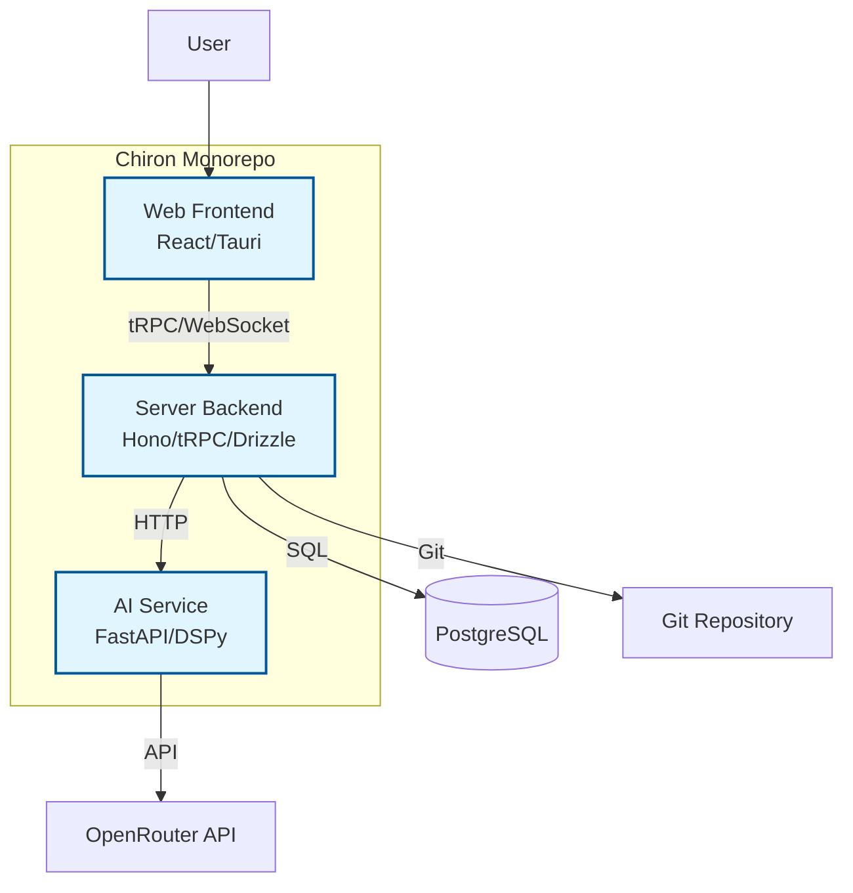
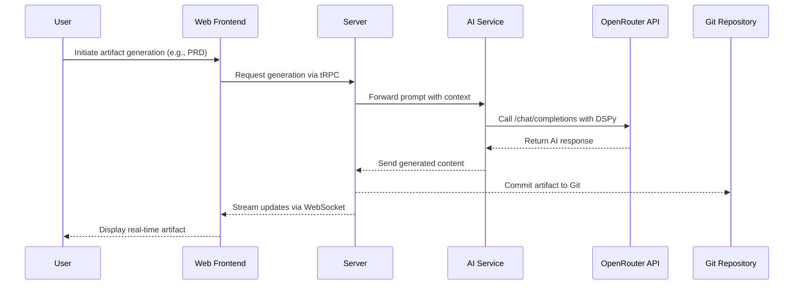
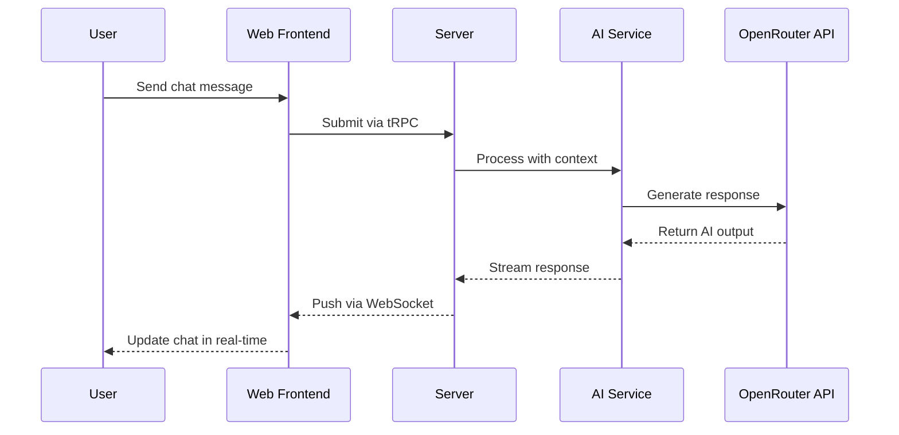

## Components

Based on the architectural patterns, tech stack, and data models, the major logical components are the three services in the monorepo: AI Service, Server, and Web Frontend. Here's the component breakdown:

#### AI Service Component

**Responsibility:** Handles AI orchestration using DSPy and OpenRouter, processes prompts, generates BMAD artifacts, manages file uploads via attachments library.

**Key Interfaces:**
- /generate (POST) - Generate AI responses
- /upload (POST) - Handle file uploads
- /models (GET) - Retrieve available models

**Dependencies:** OpenRouter API, DSPy framework, attachments library, communicates with Server for data.

**Technology Stack:** Python 3.11+, FastAPI 0.104.0+, DSPy 2.5.0, Attachments 1.0.0, Uvicorn 0.24.0+

#### Server Component

**Responsibility:** Manages backend logic, database operations, tRPC API, real-time WebSocket updates, Git integration for artifacts.

**Key Interfaces:**
- /trpc/* (POST/GET) - tRPC endpoints for CRUD operations
- /api/health (GET) - Health check
- WebSocket /ws - Real-time updates

**Dependencies:** Database (PostgreSQL), Git repository, communicates with AI Service and Web.

**Technology Stack:** TypeScript 5.8.2, Bun 1.2.22, Hono 4.8.2, tRPC 11.5.0, Drizzle ORM 0.44.2, Zod 4.0.2

#### Web Component

**Responsibility:** Provides cross-platform desktop UI, split-screen workspace, chat interface, artifact display, Kanban boards.

**Key Interfaces:**
- / (GET) - Main app interface
- Integrates with Server via tRPC and WebSocket

**Dependencies:** Server for data, Tauri for desktop wrapper.

**Technology Stack:** React 19.1.0, TanStack Router 1.114.25, Tailwind CSS 4.0.15, Tauri 2.4.0, TanStack Query 5.85.5

#### Component Diagrams

**Detailed Rationale for Components Section:**
- **Trade-offs and Choices:** Kept to three main components per PRD microservices pattern; could split further if needed for scalability.
- **Key Assumptions:** Assumed clear boundaries with Server as orchestrator; AI isolated as per PRD.
- **Interesting Decisions:** Web as desktop app via Tauri for native features; AI service in Python for DSPy compatibility.
- **Areas for Validation:** Verify if additional shared components (e.g., utilities) are needed.

## External APIs

The project requires external API integrations, primarily OpenRouter for AI functionality.

#### OpenRouter API

- **Purpose:** Primary AI provider for LLM access, model management, and chat completions.
- **Documentation:** https://openrouter.ai/docs
- **Base URL(s):** https://openrouter.ai/api/v1
- **Authentication:** Bearer token with API key
- **Rate Limits:** Provider-specific (e.g., requests per minute based on plan); implement retry logic.

**Key Endpoints Used:**
- `GET /models` - Retrieve available models
- `POST /chat/completions` - Generate chat responses

**Integration Notes:** Integrated via AI SDK in server and DSPy in AI service; handle errors, retries, and usage tracking per PRD.

**Detailed Rationale for External APIs Section:**
- **Trade-offs and Choices:** Focused on OpenRouter as per PRD; could add fallbacks if needed.
- **Key Assumptions:** Assumed API stability; monitor for changes.
- **Interesting Decisions:** Centralized in AI service for isolation.
- **Areas for Validation:** Confirm rate limits and add more endpoints if required.

## Core Workflows

Key system workflows include BMAD artifact generation and real-time chat interaction.

#### BMAD Artifact Generation Workflow

#### Real-Time Chat Interaction Workflow

**Detailed Rationale for Core Workflows Section:**
- **Trade-offs and Choices:** Focused on critical paths from PRD; kept diagrams high-level for clarity.
- **Key Assumptions:** Assumed WebSocket for real-time; if performance issues, optimize.
- **Interesting Decisions:** Streaming responses for better UX.
- **Areas for Validation:** Verify if additional workflows (e.g., file upload) are needed.

