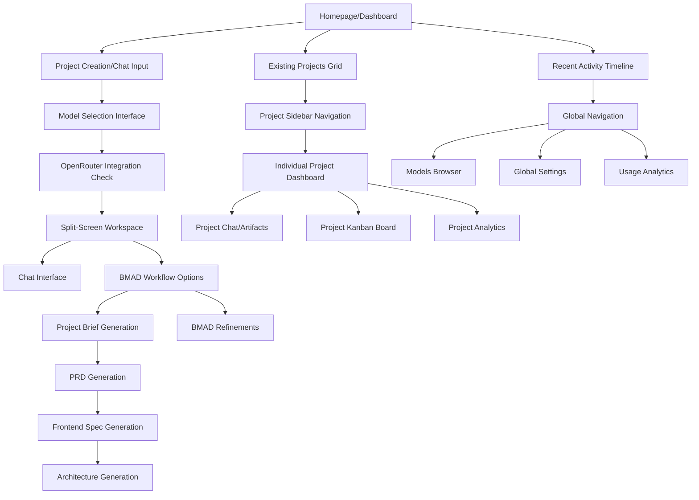

# Chiron UI/UX Specification

This document defines the user experience goals, information architecture, user flows, and visual design specifications for Chiron's user interface. It serves as the foundation for visual design and frontend development, ensuring a cohesive and user-centered experience.

## Overall UX Goals & Principles

### Target User Personas

**Primary Persona: Solo Developer**
- Individual developers working on personal or professional projects
- Value structured guidance and project discipline without external accountability
- Need to maintain high-quality documentation and planning processes
- Seek to reduce cognitive load from tool fragmentation
- Want efficient workflows that bridge planning to implementation

**Secondary Persona: Technical Lead**
- Developers managing multiple projects simultaneously
- Require visibility into project progress and artifact generation
- Need to maintain consistency across different project types
- Value automation and AI assistance for routine tasks

### Usability Goals

- **Efficiency of Use:** Enable 50% faster BMAD artifact sequence completion compared to manual methods
- **Reduced Context Switching:** Achieve 70% reduction in tool-switching time through unified interface
- **Error Prevention:** Implement clear validation and confirmation for destructive actions (project deletion, artifact overrides)
- **Learnability:** New users can complete first BMAD sequence within 30 minutes without external guidance
- **Memorability:** Infrequent users can return to projects and understand current state without relearning workflows

### Design Principles

1. **Unified Context Over Fragmentation** - Consolidate all project-related information and interactions within a single application ecosystem, enabling seamless navigation between different interfaces (chat, Kanban boards, artifact viewers, agent views) through unified navigation like the command palette, rather than switching between separate tools or applications.

2. **Real-Time Synchronization** - Show immediate visual feedback for all actions, especially artifact generation and chat responses

3. **Progressive Disclosure** - Present complex workflows in manageable steps with clear progression indicators

4. **Professional Focus** - Use Winter color palette and clean design to maintain developer concentration and reduce visual fatigue

5. **Accessible by Default** - Ensure all interactions work via keyboard and screen reader from the start

## Information Architecture (IA)

### Site Map / Screen Inventory

### Navigation Structure

**Primary Navigation:**
- **Homepage/Dashboard** - Central hub displaying existing projects, recent activity, and entry point for new project creation
- **Project Sidebar** - Teams-style project switcher for seamless navigation between active projects
- **Split-Screen Workspace** - Primary interface combining chat interface with real-time artifact display
- **Planning** - Kanban boards for task management and project tracking
- **Models** - Dedicated AI model browser and configuration interface
- **Analytics** - Usage tracking, billing, and performance insights
- **Settings** - Global application configuration including OpenRouter API setup

**Secondary Navigation:**
- **Project-Level**: Within each project - Dashboard → Chat/Artifacts → Tasks → Analytics
- **Contextual Actions**: Command palette for quick navigation and project switching
- **Breadcrumb Navigation**: Shows current location within project hierarchy

**Homepage Layout:**
- **Project Grid/Cards** - Visual display of existing projects with status indicators and quick actions
- **Chat Input Area** - Integrated model selection and project idea input
- **Recent Activity** - Timeline of recent artifact generations and project updates
- **Model Status Indicator** - Shows current AI model configuration and OpenRouter integration status

**Project Creation Flow:**
1. **Homepage Entry** - Users land on homepage showing existing projects and chat input
2. **Model Selection** - Choose AI model directly in chat interface
3. **OpenRouter Check** - Prompt for API key setup if not configured
4. **Project Idea Input** - Describe project concept in natural language
5. **Split-Screen Transition** - Load workspace with chat (left) and BMAD options (right)
6. **BMAD Decision Point** - Choose between refinements (brainstorming, market research) or direct project brief generation
7. **Planning Flow** - Progress through BMAD sequence (Brief → PRD → Frontend Spec → Architecture) with real-time artifact display

**Navigation Patterns:**
- **Command Palette** - Primary method for quick transitions between projects and functional areas
- **Project Sidebar** - Teams-inspired project switcher for maintaining context across multiple projects
- **Contextual Menus** - Right-click and hover actions for quick project operations
- **Keyboard Shortcuts** - Accelerate navigation for power users

## Checklist Results

**Note:** No specific UI/UX checklist was found in the project dependencies. The specification has been reviewed against general UX best practices and incorporates feedback from the iterative development process.

**Key Validation Points:**
- ✅ User flows validated through user feedback and iterative refinement
- ✅ Information architecture supports the described project creation and BMAD workflows
- ✅ Component definitions align with shadcn/ui foundation and Chiron-specific needs
- ✅ Accessibility requirements meet WCAG AA standards via shadcn/ui compliance
- ✅ Responsive strategy covers target devices and developer workflows
- ✅ Performance goals are realistic for real-time AI interactions

## Change Log

| Date | Version | Description | Author |
|------|---------|-------------|--------|
| 2025-10-08 | v1.0 | Initial UI/UX specification creation | UX Expert |
| 2025-10-08 | v1.1 | Updated for shadcn/ui foundation and practical implementation approach | UX Expert |