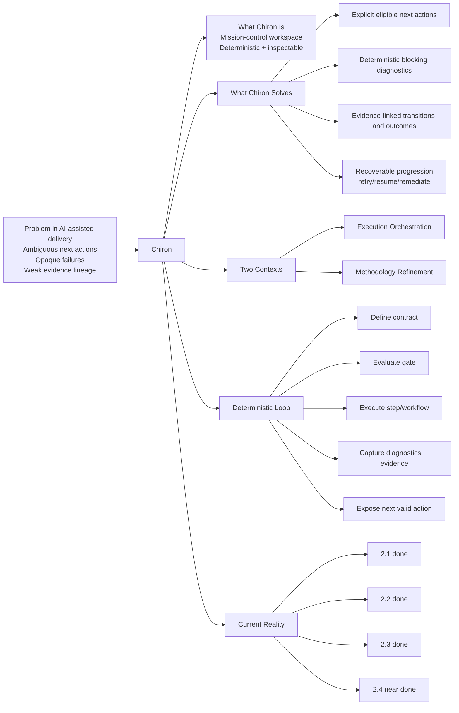

# Chiron Problem-Solution Excalidraw Pack

Date: 2026-03-04
Purpose: Fast visual board focused on what Chiron is and what it solves.

## Quick Setup in Excalidraw (5 minutes)

1. Create a new board.
2. Add seven frames left-to-right:
   - A. The Problem
   - B. What Chiron Is
   - C. What Chiron Solves
   - D. How It Works (Deterministic Loop)
   - E. Proof From Current Implementation
   - F. Story Timeline + Screenshot Wall
   - G. Glossary (Term Lock)
3. Paste the text blocks below into sticky notes.
4. Add arrows from A -> B -> C -> D -> E -> F -> G.
5. Keep F as the living section you update each story.
6. Keep G locked after alignment to avoid term drift.

## Sticky Text Blocks (Copy/Paste)

### A) The Problem

```text
Software delivery with AI often fails because:
- Next action is ambiguous
- Failures are hard to diagnose
- State changes are not reproducible
- Evidence is scattered across tools
```

### B) What Chiron Is

```text
Chiron is a mission-control workspace for deterministic,
inspectable, AI-assisted software delivery.

Two operating contexts:
1) Execution Orchestration (default runtime control)
2) Methodology Refinement (episodic contract authoring)
```

### C) What Chiron Solves

```text
Chiron turns ambiguity into explicit progression:
- Shows eligible next actions
- Blocks unsafe progression with deterministic diagnostics
- Captures evidence for every key transition
- Makes recovery explicit (retry/resume/remediate)
```

### D) How It Works (Deterministic Loop)

```text
Define contract -> Evaluate gate/conditions -> Execute step/workflow
-> Capture diagnostics + evidence -> Expose next valid action

State contract everywhere:
normal | loading | blocked | failed | success
```

### E) Proof From Current Implementation

```text
Already delivered:
- Story 2.1: methodology foundation flow
- Story 2.2: graph/list authoring workspace
- Story 2.3: diagnostics-first publish + evidence hardening
- Story 2.4: typed fact authoring + deterministic validation (near done)

Implemented step types:
form | agent | action | invoke | branch | display
```

### F) Story Timeline + Screenshot Wall (Living)

```text
Update rule after each story:
1) Add one story card
2) Add >= 2 screenshots (hero + blocked/diagnostic)
3) Update one impacted journey lane

Card template:
Story:
Status:
What changed (max 3 bullets):
UX implication:
Screenshot links:
```

### G) Glossary (Term Lock)

```text
TERM LOCK (from Chiron glossary v1)

Methodology:
Versioned delivery model composed of facts, work units,
transitions, workflows, and step contracts.

Methodology Version:
Immutable publishable revision (draft before publish, active after publish).

Work Unit:
Method-defined unit type instantiated in a project.

Workflow Definition vs Workflow Execution (Run):
Design-time graph contract vs one runtime instance.

Step:
Executable workflow node: form | action | agent | branch | display | invoke.

Transition Guard:
Deterministic rule set deciding transition eligibility.

Step State:
pending | in_progress | completed | blocked | failed | skipped |
superseded | cancelled.

IMPORTANT
Use these exact terms on the canvas. Avoid ad-hoc synonyms.
```

## Mermaid Option (Import Into Excalidraw)

In Excalidraw, use Insert -> Mermaid and paste this:



## Screenshot Targets to Add Now

- `apps/web/src/features/methodologies/workspace-shell.tsx` (header + state indicator).
- `apps/web/src/features/methodologies/version-workspace-graph.tsx` (L1/L2/L3 graph and list mode).
- `apps/web/src/features/methodologies/version-workspace.tsx` (typed fact editor and validation modes).
- `apps/web/src/routes/methodologies.$methodologyId.versions.$versionId.tsx` (publish panel + evidence table).

## Canonical Glossary Source

- `_bmad-output/planning-artifacts/archive/2026-02-reset/foundation-locks/chiron-terminology-glossary-v1.md`
